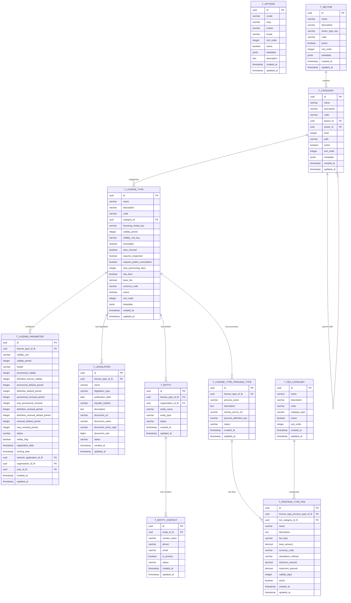
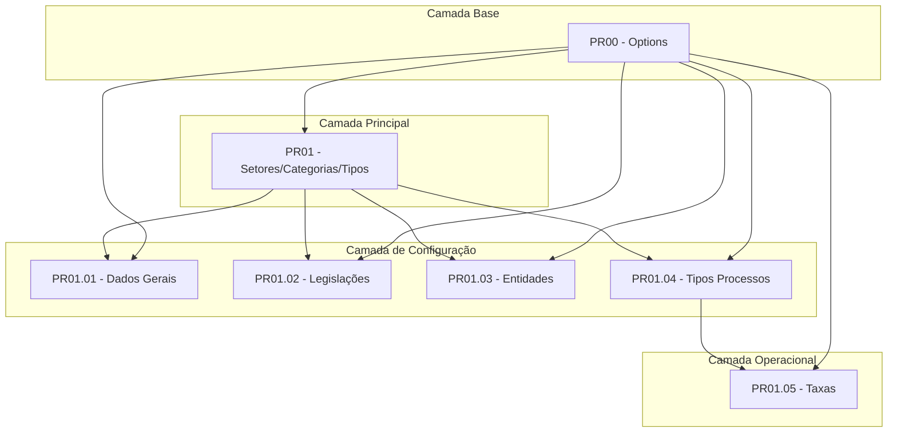

# BE-LIC-Parametrização-Licenciamento
## Sistema de Licenciamento de Cabo Verde - Especificação Consolidada do Backend

## 1. Visão Geral da Arquitetura

O Sistema de Licenciamento de Cabo Verde é estruturado em módulos interdependentes que seguem os princípios de Domain-Driven Design (DDD). A arquitetura é composta por 7 módulos principais que trabalham em conjunto para fornecer uma solução completa de gestão de licenciamento.

### 1.1 Módulos do Sistema

1. **PR00 - Parametrização Base (Options)**: Sistema central de configurações e opções
2. **PR01 - Setores, Categorias e Tipos de Licenças**: Estrutura hierárquica de licenciamento
3. **PR01.01 - Dados Gerais**: Parâmetros específicos dos tipos de licença
4. **PR01.02 - Legislações**: Gestão de documentos normativos
5. **PR01.03 - Entidades**: Gestão de entidades reguladoras
6. **PR01.04 - Tipos de Processos**: Associação com servidores Activity
7. **PR01.05 - Taxas**: Sistema de cobrança por processo

### 1.2 Princípios Arquiteturais

- **Domain-Driven Design (DDD)**: Separação clara entre Domain, Application, Infrastructure e Interface layers
- **Microserviços Modulares**: Cada módulo pode evoluir independentemente
- **Event-Driven Architecture**: Comunicação através de eventos de domínio
- **CQRS Pattern**: Separação entre comandos e consultas quando necessário
- **Cache Strategy**: Cache inteligente para performance otimizada

## 2. Modelo de Dados Consolidado

### 2.1 Diagrama ER Unificado



### 2.2 Entidades Principais

#### 2.2.1 Hierarquia de Licenciamento
- **Setor**: Setores económicos (Agricultura, Turismo, Indústria)
- **Categoria**: Estrutura hierárquica de atividades económicas
- **Tipo de Licença**: Configuração específica de licenciamento

#### 2.2.2 Configurações e Parâmetros
- **Options**: Sistema central de parametrizações
- **License Parameter**: Parâmetros específicos por tipo de licença
- **Legislation**: Documentos normativos associados

#### 2.2.3 Entidades Operacionais
- **Entity**: Entidades reguladoras (Ministérios, Agências, Inspeções)
- **Process Type**: Definições de processos no Activity
- **Fee**: Sistema de taxas por processo

## 3. Fluxo de Dependências entre Módulos

### 3.1 Diagrama de Dependências



### 3.2 Ordem de Implementação Recomendada

1. **PR00 - Options**: Base para todas as parametrizações
2. **PR01 - Setores/Categorias/Tipos**: Estrutura hierárquica fundamental
3. **PR01.01 - Dados Gerais**: Parâmetros específicos dos tipos
4. **PR01.02 - Legislações**: Documentos normativos
5. **PR01.03 - Entidades**: Entidades reguladoras
6. **PR01.04 - Tipos Processos**: Integração com Activity
7. **PR01.05 - Taxas**: Sistema de cobrança

## 4. Arquitetura DDD Unificada

### 4.1 Estrutura de Camadas

```
src/main/java/cv/gov/licensing/
├── domain/
│   ├── shared/                           # Shared Kernel
│   │   ├── valueobjects/                # Value Objects comuns
│   │   ├── events/                      # Domain Events
│   │   └── exceptions/                  # Domain Exceptions
│   ├── parameterization/                # PR00 - Options
│   │   ├── Option.java
│   │   ├── OptionRepository.java
│   │   └── ParameterizationDomainService.java
│   ├── licensing/                       # PR01 - Core
│   │   ├── sector/
│   │   ├── category/
│   │   └── licensetype/
│   ├── parameter/                       # PR01.01
│   ├── legislation/                     # PR01.02
│   ├── entity/                         # PR01.03
│   ├── process/                        # PR01.04
│   └── fee/                           # PR01.05
├── application/
│   ├── shared/                         # Application Services comuns
│   ├── parameterization/
│   ├── licensing/
│   ├── parameter/
│   ├── legislation/
│   ├── entity/
│   ├── process/
│   └── fee/
├── interfaces/
│   └── rest/
│       ├── ParameterizationController.java
│       ├── LicensingController.java
│       ├── ParameterController.java
│       ├── LegislationController.java
│       ├── EntityController.java
│       ├── ProcessController.java
│       └── FeeController.java
└── infrastructure/
    ├── persistence/
    ├── cache/
    ├── integration/                    # Activity Server Integration
    └── storage/                       # Document Storage (Minio)
```

### 4.2 Bounded Contexts

1. **Parameterization Context**: Gestão de opções e configurações base
2. **Licensing Context**: Hierarquia de setores, categorias e tipos
3. **Configuration Context**: Parâmetros, legislações e entidades
4. **Process Context**: Integração com workflows externos
5. **Financial Context**: Gestão de taxas e cálculos

### 4.3 Shared Kernel

```java
// Value Objects Comuns
public class Money {
    private final BigDecimal amount;
    private final Currency currency;
    
    public static Money cvEscudos(BigDecimal amount) {
        return new Money(amount, Currency.getInstance("CVE"));
    }
}

public class AuditInfo {
    private final Instant createdAt;
    private final Instant updatedAt;
    private final String createdBy;
    private final String updatedBy;
}

// Domain Events
public interface DomainEvent {
    Instant occurredAt();
    String eventType();
}

// Base Aggregate
public abstract class AggregateRoot<ID> {
    protected ID id;
    private List<DomainEvent> domainEvents = new ArrayList<>();
    
    protected void addDomainEvent(DomainEvent event) {
        domainEvents.add(event);
    }
    
    public List<DomainEvent> getDomainEvents() {
        return Collections.unmodifiableList(domainEvents);
    }
    
    public void clearDomainEvents() {
        domainEvents.clear();
    }
}
```

## 5. APIs Principais Consolidadas

### 5.1 Endpoints por Módulo

#### 5.1.1 PR00 - Parametrização Base
```
GET    /api/v1/options/{code}                    # Consultar opções por código
GET    /api/v1/options                           # Consultar múltiplos códigos
POST   /api/v1/options/admin                     # Criar opção (admin)
PUT    /api/v1/options/admin/{id}                # Atualizar opção (admin)
DELETE /api/v1/options/admin/{id}                # Eliminar opção (admin)
```

#### 5.1.2 PR01 - Setores/Categorias/Tipos
```
# Setores
GET    /api/v1/sectors                           # Listar setores
POST   /api/v1/sectors                           # Criar setor
PUT    /api/v1/sectors/{id}                      # Atualizar setor
DELETE /api/v1/sectors/{id}                      # Eliminar setor

# Categorias
GET    /api/v1/categories/tree                   # Árvore hierárquica
POST   /api/v1/categories                        # Criar categoria
PUT    /api/v1/categories/{id}/move              # Mover categoria

# Tipos de Licença
GET    /api/v1/license-types                     # Listar tipos
POST   /api/v1/license-types                     # Criar tipo
PUT    /api/v1/license-types/{id}                # Atualizar tipo
```

#### 5.1.3 PR01.01 - Dados Gerais
```
GET    /api/v1/license-parameters                # Listar parâmetros
POST   /api/v1/license-parameters                # Criar parâmetros
PUT    /api/v1/license-parameters/{id}           # Atualizar parâmetros
GET    /api/v1/license-parameters/license-type/{id} # Por tipo de licença
```

#### 5.1.4 PR01.02 - Legislações
```
GET    /api/v1/legislations                      # Listar legislações
POST   /api/v1/legislations                      # Criar legislação
PUT    /api/v1/legislations/{id}                 # Atualizar legislação
POST   /api/v1/legislations/{id}/document        # Upload documento
DELETE /api/v1/legislations/{id}/document       # Remover documento
```

#### 5.1.5 PR01.03 - Entidades
```
GET    /api/v1/entities                          # Listar entidades
POST   /api/v1/entities                          # Criar entidade
PUT    /api/v1/entities/{id}                     # Atualizar entidade
POST   /api/v1/entities/{id}/contacts            # Adicionar contacto
DELETE /api/v1/entities/{id}/contacts/{contactId} # Remover contacto
```

#### 5.1.6 PR01.04 - Tipos de Processos
```
GET    /api/v1/process-types                     # Listar associações
POST   /api/v1/process-types                     # Criar associação
PUT    /api/v1/process-types/{id}                # Atualizar associação
POST   /api/v1/process-types/validate            # Validar definição
```

#### 5.1.7 PR01.05 - Taxas
```
GET    /api/v1/fees                              # Listar taxas
POST   /api/v1/fees                              # Criar taxa
PUT    /api/v1/fees/{id}                         # Atualizar taxa
POST   /api/v1/fees/calculate                    # Calcular taxas
GET    /api/v1/fee-categories                    # Listar categorias
```

### 5.2 Padrões de Response Unificados

```java
// Response padrão para listagens
public class PagedResponse<T> {
    private List<T> content;
    private PageInfo pageable;
    private long totalElements;
    private int totalPages;
}

// Response padrão para erros
public class ErrorResponse {
    private String error;
    private String message;
    private String timestamp;
    private String path;
    private List<ValidationError> validationErrors;
}

// Response padrão para operações
public class OperationResponse {
    private boolean success;
    private String message;
    private Object data;
}
```

## 6. Integrações Externas

### 6.1 Servidores Activity (Activiti/Camunda)

```java
@Component
public class ActivityServerIntegration {
    
    public ProcessDefinitionInfo validateProcessDefinition(
            String serverUrl, String processDefinitionKey) {
        // Validação de definições de processo
    }
    
    public List<ProcessDefinition> getAvailableProcesses(String serverUrl) {
        // Listar processos disponíveis
    }
}
```

### 6.2 Sistema de Armazenamento (Minio)

```java
@Component
public class DocumentStorageService {
    
    public String uploadDocument(MultipartFile file, String folder) {
        // Upload de documentos
    }
    
    public void deleteDocument(String documentUrl) {
        // Eliminação de documentos
    }
}
```

### 6.3 Sistema de Organizações Globais

```java
@Component
public class OrganizationService {
    
    public OrganizationId findOrCreateOrganization(String organizationName) {
        // Integração com REDGLOBAL.GLB_T_ORGANIZATION
    }
}
```

## 7. Considerações de Implementação

### 7.1 Estratégia de Cache

```yaml
# Cache Configuration
spring:
  cache:
    type: caffeine
    caffeine:
      spec: maximumSize=1000,expireAfterWrite=1h
    cache-names:
      - options
      - sectors
      - categories
      - license-types
      - fee-categories
```

### 7.2 Configuração de Base de Dados

```yaml
# Database Configuration
spring:
  datasource:
    url: jdbc:postgresql://localhost:5432/licensing
    username: ${DB_USERNAME}
    password: ${DB_PASSWORD}
  jpa:
    hibernate:
      ddl-auto: validate
    properties:
      hibernate:
        dialect: org.hibernate.dialect.PostgreSQLDialect
        format_sql: true
  flyway:
    locations: classpath:db/migration
    baseline-on-migrate: true
```

### 7.3 Segurança e Autorização

```java
@Configuration
@EnableWebSecurity
public class SecurityConfig {
    
    @Bean
    public SecurityFilterChain filterChain(HttpSecurity http) throws Exception {
        http.authorizeHttpRequests(authz -> authz
            .requestMatchers(HttpMethod.GET, "/api/v1/options/**").permitAll()
            .requestMatchers("/api/v1/**/admin/**").hasRole("ADMIN")
            .requestMatchers(HttpMethod.POST, "/api/v1/**").hasRole("USER")
            .requestMatchers(HttpMethod.PUT, "/api/v1/**").hasRole("USER")
            .requestMatchers(HttpMethod.DELETE, "/api/v1/**").hasRole("ADMIN")
            .anyRequest().authenticated()
        );
        return http.build();
    }
}
```

### 7.4 Monitorização e Observabilidade

```java
@Component
public class LicensingMetrics {
    
    private final Counter licenseCreationCounter;
    private final Timer licenseProcessingTimer;
    private final Gauge activeLicensesGauge;
    
    public LicensingMetrics(MeterRegistry meterRegistry) {
        this.licenseCreationCounter = Counter.builder("licenses.created.total")
            .description("Total number of licenses created")
            .register(meterRegistry);
            
        this.licenseProcessingTimer = Timer.builder("license.processing.time")
            .description("Time taken to process license applications")
            .register(meterRegistry);
            
        this.activeLicensesGauge = Gauge.builder("licenses.active.count")
            .description("Number of active licenses")
            .register(meterRegistry, this, LicensingMetrics::getActiveLicenseCount);
    }
}
```

### 7.5 Testes e Qualidade

```java
// Testes de Integração com Testcontainers
@SpringBootTest
@Testcontainers
class LicensingIntegrationTest {
    
    @Container
    static PostgreSQLContainer<?> postgres = new PostgreSQLContainer<>("postgres:16")
            .withDatabaseName("licensing_test")
            .withUsername("test")
            .withPassword("test");
    
    @Container
    static MinIOContainer minio = new MinIOContainer("minio/minio:latest")
            .withUserName("minioadmin")
            .withPassword("minioadmin");
}
```

## 8. Roadmap de Desenvolvimento

### 8.1 Fase 1 - Fundação (4-6 semanas)
- Implementação do módulo Options (PR00)
- Estrutura base DDD e Shared Kernel
- Configuração de infraestrutura (DB, Cache, Security)

### 8.2 Fase 2 - Core (6-8 semanas)
- Implementação da hierarquia Setores/Categorias/Tipos (PR01)
- APIs REST básicas
- Testes unitários e de integração

### 8.3 Fase 3 - Configuração (4-6 semanas)
- Parâmetros Gerais (PR01.01)
- Legislações (PR01.02)
- Entidades (PR01.03)

### 8.4 Fase 4 - Integração (4-6 semanas)
- Tipos de Processos (PR01.04)
- Integração com Activity Servers
- Taxas (PR01.05)

### 8.5 Fase 5 - Otimização (2-4 semanas)
- Performance tuning
- Monitorização e métricas
- Documentação final

## 9. Considerações de Performance

### 9.1 Otimizações de Base de Dados
- Índices estratégicos em campos de consulta frequente
- Paginação obrigatória em todas as listagens
- Queries otimizadas com JPA Criteria API
- Connection pooling configurado adequadamente

### 9.2 Cache Strategy
- Cache L1: Hibernate Second Level Cache
- Cache L2: Redis para dados compartilhados
- Cache L3: CDN para recursos estáticos

### 9.3 Monitorização
- Métricas de performance com Micrometer
- Logging estruturado com Logback
- Health checks para todos os componentes
- Alertas automáticos para degradação de performance

## 10. Conclusão

Este documento consolida a especificação completa do backend do Sistema de Licenciamento de Cabo Verde, fornecendo uma visão unificada da arquitetura, modelo de dados, APIs e considerações de implementação. A estrutura modular e os princípios DDD garantem escalabilidade, manutenibilidade e evolução contínua do sistema.

A implementação deve seguir a ordem de dependências estabelecida, começando pela base de parametrizações e evoluindo gradualmente para os módulos mais complexos. O foco na qualidade, testes e monitorização assegura um sistema robusto e confiável para as necessidades de licenciamento de Cabo Verde.

---

**Documento**: BE-LIC-Parametrização-Licenciamento  
**Versão**: 1.0  
**Data**: Janeiro 2024  
**Autor**: Sistema de Licenciamento - Cabo Verde