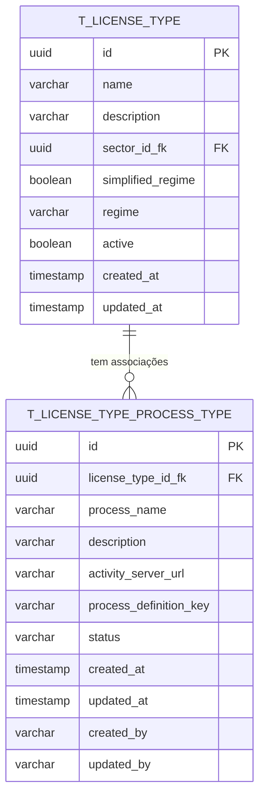

# PR01.04-BE-LIC-Dossier Tipo Licença - Associação Tipo Processos

## 1. Visão Geral

Este documento especifica a implementação do módulo de **Associação de Tipos de Processos** para o Sistema de Licenciamento de Cabo Verde. O módulo é responsável pela gestão das associações entre tipos de licença e tipos de processos, integrando com servidores Activity para buscar definições de processos.

### 1.1 Objetivos

* Normalizar o modelo de dados para associações tipo licença - tipo processo

* Implementar arquitetura DDD para gestão de associações de processos

* Fornecer APIs REST para CRUD de associações com filtros avançados

* Integrar com servidores Activity externos para definições de processos

* Garantir validações robustas e integridade referencial

* Suportar múltiplos servidores Activity configuráveis

## 2. Modelo de Dados Normalizado

### 2.1 Diagrama ER



### 2.2 Definição da Tabela T\_LICENSE\_TYPE\_PROCESS\_TYPE

```sql
CREATE TABLE t_license_type_process_type (
    id UUID PRIMARY KEY DEFAULT gen_random_uuid(),
    license_type_id_fk UUID NOT NULL,
    process_name VARCHAR(255) NOT NULL,
    description TEXT,
    activity_server_url VARCHAR(500) NOT NULL,
    process_definition_key VARCHAR(255) NOT NULL,
    status VARCHAR(20) NOT NULL DEFAULT 'ACTIVE',
    created_at TIMESTAMP WITH TIME ZONE NOT NULL DEFAULT NOW(),
    updated_at TIMESTAMP WITH TIME ZONE NOT NULL DEFAULT NOW(),
    created_by VARCHAR(100) NOT NULL,
    updated_by VARCHAR(100) NOT NULL,
    
    CONSTRAINT fk_license_type_process_type_license_type 
        FOREIGN KEY (license_type_id_fk) REFERENCES t_license_type(id) ON DELETE CASCADE,
    CONSTRAINT chk_process_name_not_empty 
        CHECK (LENGTH(TRIM(process_name)) > 0),
    CONSTRAINT chk_activity_server_url_not_empty 
        CHECK (LENGTH(TRIM(activity_server_url)) > 0),
    CONSTRAINT chk_process_definition_key_not_empty 
        CHECK (LENGTH(TRIM(process_definition_key)) > 0),
    CONSTRAINT chk_license_type_process_type_status 
        CHECK (status IN ('ACTIVE', 'INACTIVE')),
    CONSTRAINT uq_license_type_process_definition_key 
        UNIQUE (license_type_id_fk, process_definition_key)
);
```

### 2.3 Índices

```sql
-- Índice principal para consultas por tipo de licença
CREATE INDEX idx_license_type_process_type_license_type ON t_license_type_process_type(license_type_id_fk);

-- Índice para consultas por status
CREATE INDEX idx_license_type_process_type_status ON t_license_type_process_type(status) WHERE status = 'ACTIVE';

-- Índice para consultas por chave de definição do processo
CREATE INDEX idx_license_type_process_type_process_key ON t_license_type_process_type(process_definition_key);

-- Índice para auditoria
CREATE INDEX idx_license_type_process_type_created_at ON t_license_type_process_type(created_at DESC);

-- Índice composto para consultas filtradas
CREATE INDEX idx_license_type_process_type_license_status ON t_license_type_process_type(license_type_id_fk, status);

-- Índice para busca textual por nome do processo
CREATE INDEX idx_license_type_process_type_name_search ON t_license_type_process_type USING gin(to_tsvector('portuguese', process_name));

-- Índice para consultas por URL do servidor Activity
CREATE INDEX idx_license_type_process_type_server_url ON t_license_type_process_type(activity_server_url);
```

## 3. Arquitetura DDD

### 3.1 Domain Layer

#### 3.1.1 Aggregate Root: LicenseTypeProcessType

```java
@Entity
@Table(name = "t_license_type_process_type")
public class LicenseTypeProcessType {
    @Id
    private LicenseTypeProcessTypeId id;
    
    @Column(name = "license_type_id_fk", nullable = false)
    private LicenseTypeId licenseTypeId;
    
    @Column(name = "process_name", nullable = false, length = 255)
    private String processName;
    
    @Column(name = "description")
    private String description;
    
    @Column(name = "activity_server_url", nullable = false, length = 500)
    private String activityServerUrl;
    
    @Column(name = "process_definition_key", nullable = false, length = 255)
    private String processDefinitionKey;
    
    @Column(name = "status", nullable = false)
    private String status;
    
    // Campos de auditoria
    @Column(name = "created_at", nullable = false)
    private Instant createdAt;
    
    @Column(name = "updated_at", nullable = false)
    private Instant updatedAt;
    
    @Column(name = "created_by", nullable = false)
    private String createdBy;
    
    @Column(name = "updated_by", nullable = false)
    private String updatedBy;
    
    // Métodos de negócio
    public static LicenseTypeProcessType create(
            LicenseTypeId licenseTypeId,
            String processName,
            String description,
            String activityServerUrl,
            String processDefinitionKey,
            String createdBy,
            ActivityServerValidator activityServerValidator) {
        
        validateCreationParameters(licenseTypeId, processName, activityServerUrl, processDefinitionKey, createdBy, activityServerValidator);
        
        return new LicenseTypeProcessType(
            LicenseTypeProcessTypeId.generate(),
            licenseTypeId,
            processName.trim(),
            description != null ? description.trim() : null,
            activityServerUrl.trim(),
            processDefinitionKey.trim(),
            "ACTIVE",
            createdBy
        );
    }
    
    public void updateProcessInfo(
            String processName,
            String description,
            String activityServerUrl,
            String processDefinitionKey,
            String updatedBy,
            ActivityServerValidator activityServerValidator) {
        
        validateUpdateParameters(processName, activityServerUrl, processDefinitionKey, updatedBy, activityServerValidator);
        
        this.processName = processName.trim();
        this.description = description != null ? description.trim() : null;
        this.activityServerUrl = activityServerUrl.trim();
        this.processDefinitionKey = processDefinitionKey.trim();
        this.updatedBy = updatedBy;
        this.updatedAt = Instant.now();
    }
    
    public void activate(String updatedBy) {
        this.status = "ACTIVE";
        this.updatedBy = updatedBy;
        this.updatedAt = Instant.now();
    }
    
    public void deactivate(String updatedBy) {
        this.status = "INACTIVE";
        this.updatedBy = updatedBy;
        this.updatedAt = Instant.now();
    }
    
    // Métodos de validação
    private static void validateCreationParameters(
            LicenseTypeId licenseTypeId,
            String processName,
            String activityServerUrl,
            String processDefinitionKey,
            String createdBy,
            ActivityServerValidator activityServerValidator) {
        
        if (licenseTypeId == null) {
            throw new IllegalArgumentException("License type ID cannot be null");
        }
        
        if (processName == null || processName.trim().isEmpty()) {
            throw new IllegalArgumentException("Process name cannot be null or empty");
        }
        
        if (processName.trim().length() > 255) {
            throw new IllegalArgumentException("Process name cannot exceed 255 characters");
        }
        
        if (activityServerUrl == null || activityServerUrl.trim().isEmpty()) {
            throw new IllegalArgumentException("Activity server URL cannot be null or empty");
        }
        
        if (activityServerUrl.trim().length() > 500) {
            throw new IllegalArgumentException("Activity server URL cannot exceed 500 characters");
        }
        
        if (!activityServerValidator.isValidUrl(activityServerUrl)) {
            throw new IllegalArgumentException("Invalid Activity server URL format");
        }
        
        if (processDefinitionKey == null || processDefinitionKey.trim().isEmpty()) {
            throw new IllegalArgumentException("Process definition key cannot be null or empty");
        }
        
        if (processDefinitionKey.trim().length() > 255) {
            throw new IllegalArgumentException("Process definition key cannot exceed 255 characters");
        }
        
        if (createdBy == null || createdBy.trim().isEmpty()) {
            throw new IllegalArgumentException("Created by cannot be null or empty");
        }
    }
    
    private static void validateUpdateParameters(
            String processName,
            String activityServerUrl,
            String processDefinitionKey,
            String updatedBy,
            ActivityServerValidator activityServerValidator) {
        
        if (processName == null || processName.trim().isEmpty()) {
            throw new IllegalArgumentException("Process name cannot be null or empty");
        }
        
        if (processName.trim().length() > 255) {
            throw new IllegalArgumentException("Process name cannot exceed 255 characters");
        }
        
        if (activityServerUrl == null || activityServerUrl.trim().isEmpty()) {
            throw new IllegalArgumentException("Activity server URL cannot be null or empty");
        }
        
        if (activityServerUrl.trim().length() > 500) {
            throw new IllegalArgumentException("Activity server URL cannot exceed 500 characters");
        }
        
        if (!activityServerValidator.isValidUrl(activityServerUrl)) {
            throw new IllegalArgumentException("Invalid Activity server URL format");
        }
        
        if (processDefinitionKey == null || processDefinitionKey.trim().isEmpty()) {
            throw new IllegalArgumentException("Process definition key cannot be null or empty");
        }
        
        if (processDefinitionKey.trim().length() > 255) {
            throw new IllegalArgumentException("Process definition key cannot exceed 255 characters");
        }
        
        if (updatedBy == null || updatedBy.trim().isEmpty()) {
            throw new IllegalArgumentException("Updated by cannot be null or empty");
        }
    }
    
    // Getters
    public LicenseTypeProcessTypeId getId() { return id; }
    public LicenseTypeId getLicenseTypeId() { return licenseTypeId; }
    public String getProcessName() { return processName; }
    public String getDescription() { return description; }
    public String getActivityServerUrl() { return activityServerUrl; }
    public String getProcessDefinitionKey() { return processDefinitionKey; }
    public String getStatus() { return status; }
    public Instant getCreatedAt() { return createdAt; }
    public Instant getUpdatedAt() { return updatedAt; }
    public String getCreatedBy() { return createdBy; }
    public String getUpdatedBy() { return updatedBy; }
}
```

#### 3.1.2 Value Objects

```java
@Embeddable
public class LicenseTypeProcessTypeId {
    @Column(name = "id")
    private UUID value;
    
    public static LicenseTypeProcessTypeId generate() {
        return new LicenseTypeProcessTypeId(UUID.randomUUID());
    }
    
    public static LicenseTypeProcessTypeId of(UUID value) {
        return new LicenseTypeProcessTypeId(value);
    }
    
    public static LicenseTypeProcessTypeId of(String value) {
        return new LicenseTypeProcessTypeId(UUID.fromString(value));
    }
    
    public UUID getValue() { return value; }
}

@Embeddable
public class LicenseTypeId {
    @Column(name = "license_type_id_fk")
    private UUID value;
    
    public static LicenseTypeId of(UUID value) {
        return new LicenseTypeId(value);
    }
    
    public static LicenseTypeId of(String value) {
        return new LicenseTypeId(UUID.fromString(value));
    }
    
    public UUID getValue() { return value; }
}
```

#### 3.1.3 Domain Services

```java
@Component
public class ActivityServerValidator {
    private static final String URL_PATTERN = 
        "^(https?)://[-a-zA-Z0-9+&@#/%?=~_|!:,.;]*[-a-zA-Z0-9+&@#/%=~_|]";
    
    private final Pattern urlPattern;
    
    public ActivityServerValidator() {
        this.urlPattern = Pattern.compile(URL_PATTERN);
    }
    
    public boolean isValidUrl(String url) {
        if (url == null || url.trim().isEmpty()) {
            return false;
        }
        
        return urlPattern.matcher(url.trim()).matches();
    }
    
    public boolean isReachable(String url) {
        try {
            HttpURLConnection connection = (HttpURLConnection) new URL(url).openConnection();
            connection.setRequestMethod("HEAD");
            connection.setConnectTimeout(5000);
            connection.setReadTimeout(5000);
            
            int responseCode = connection.getResponseCode();
            return responseCode >= 200 && responseCode < 400;
        } catch (Exception e) {
            return false;
        }
    }
    
    public ProcessDefinitionInfo validateProcessDefinition(String serverUrl, String processDefinitionKey) {
        // Implementação para validar se a definição do processo existe no servidor Activity
        // Retorna informações sobre a definição do processo ou lança exceção se não encontrada
        try {
            String apiUrl = serverUrl + "/repository/process-definitions?key=" + processDefinitionKey;
            // Implementar chamada HTTP para validar a definição do processo
            return new ProcessDefinitionInfo(processDefinitionKey, true, "Process definition found");
        } catch (Exception e) {
            throw new ProcessDefinitionNotFoundException(
                "Process definition not found: " + processDefinitionKey + " on server: " + serverUrl);
        }
    }
}

public record ProcessDefinitionInfo(
    String key,
    boolean exists,
    String message
) {}

public class ProcessDefinitionNotFoundException extends RuntimeException {
    public ProcessDefinitionNotFoundException(String message) {
        super(message);
    }
}
```

### 3.2 Application Layer

#### 3.2.1 Application Services

```java
@Service
@Transactional
public class LicenseTypeProcessTypeApplicationService {
    
    private final LicenseTypeProcessTypeRepository repository;
    private final ActivityServerValidator activityServerValidator;
    
    public LicenseTypeProcessTypeApplicationService(
            LicenseTypeProcessTypeRepository repository,
            ActivityServerValidator activityServerValidator) {
        this.repository = repository;
        this.activityServerValidator = activityServerValidator;
    }
    
    public LicenseTypeProcessTypeId createAssociation(CreateLicenseTypeProcessTypeCommand command) {
        LicenseTypeProcessType association = LicenseTypeProcessType.create(
            LicenseTypeId.of(command.licenseTypeId()),
            command.processName(),
            command.description(),
            command.activityServerUrl(),
            command.processDefinitionKey(),
            command.createdBy(),
            activityServerValidator
        );
        
        return repository.save(association).getId();
    }
    
    public void updateAssociation(UpdateLicenseTypeProcessTypeCommand command) {
        LicenseTypeProcessType association = repository.findById(
            LicenseTypeProcessTypeId.of(command.id())
        ).orElseThrow(() -> new LicenseTypeProcessTypeNotFoundException(
            "Association not found with ID: " + command.id()));
        
        association.updateProcessInfo(
            command.processName(),
            command.description(),
            command.activityServerUrl(),
            command.processDefinitionKey(),
            command.updatedBy(),
            activityServerValidator
        );
        
        repository.save(association);
    }
    
    public void activateAssociation(ActivateLicenseTypeProcessTypeCommand command) {
        LicenseTypeProcessType association = repository.findById(
            LicenseTypeProcessTypeId.of(command.id())
        ).orElseThrow(() -> new LicenseTypeProcessTypeNotFoundException(
            "Association not found with ID: " + command.id()));
        
        association.activate(command.updatedBy());
        repository.save(association);
    }
    
    public void deactivateAssociation(DeactivateLicenseTypeProcessTypeCommand command) {
        LicenseTypeProcessType association = repository.findById(
            LicenseTypeProcessTypeId.of(command.id())
        ).orElseThrow(() -> new LicenseTypeProcessTypeNotFoundException(
            "Association not found with ID: " + command.id()));
        
        association.deactivate(command.updatedBy());
        repository.save(association);
    }
    
    @Transactional(readOnly = true)
    public Optional<LicenseTypeProcessType> findById(String id) {
        return repository.findById(LicenseTypeProcessTypeId.of(id));
    }
    
    @Transactional(readOnly = true)
    public List<LicenseTypeProcessType> findByLicenseTypeId(String licenseTypeId) {
        return repository.findByLicenseTypeId(LicenseTypeId.of(licenseTypeId));
    }
    
    @Transactional(readOnly = true)
    public Page<LicenseTypeProcessType> findAll(Pageable pageable) {
        return repository.findAll(pageable);
    }
    
    public void deleteAssociation(String id) {
        LicenseTypeProcessTypeId associationId = LicenseTypeProcessTypeId.of(id);
        if (!repository.existsById(associationId)) {
            throw new LicenseTypeProcessTypeNotFoundException(
                "Association not found with ID: " + id);
        }
        repository.deleteById(associationId);
    }
}

public class LicenseTypeProcessTypeNotFoundException extends RuntimeException {
    public LicenseTypeProcessTypeNotFoundException(String message) {
        super(message);
    }
}
```

#### 3.2.2 Commands

```java
public record CreateLicenseTypeProcessTypeCommand(
    String licenseTypeId,
    String processName,
    String description,
    String activityServerUrl,
    String processDefinitionKey,
    String createdBy
) {
    public CreateLicenseTypeProcessTypeCommand {
        Objects.requireNonNull(licenseTypeId, "License type ID cannot be null");
        Objects.requireNonNull(processName, "Process name cannot be null");
        Objects.requireNonNull(activityServerUrl, "Activity server URL cannot be null");
        Objects.requireNonNull(processDefinitionKey, "Process definition key cannot be null");
        Objects.requireNonNull(createdBy, "Created by cannot be null");
    }
}

public record UpdateLicenseTypeProcessTypeCommand(
    String id,
    String processName,
    String description,
    String activityServerUrl,
    String processDefinitionKey,
    String updatedBy
) {
    public UpdateLicenseTypeProcessTypeCommand {
        Objects.requireNonNull(id, "ID cannot be null");
        Objects.requireNonNull(processName, "Process name cannot be null");
        Objects.requireNonNull(activityServerUrl, "Activity server URL cannot be null");
        Objects.requireNonNull(processDefinitionKey, "Process definition key cannot be null");
        Objects.requireNonNull(updatedBy, "Updated by cannot be null");
    }
}

public record ActivateLicenseTypeProcessTypeCommand(
    String id,
    String updatedBy
) {
    public ActivateLicenseTypeProcessTypeCommand {
        Objects.requireNonNull(id, "ID cannot be null");
        Objects.requireNonNull(updatedBy, "Updated by cannot be null");
    }
}

public record DeactivateLicenseTypeProcessTypeCommand(
    String id,
    String updatedBy
) {
    public DeactivateLicenseTypeProcessTypeCommand {
        Objects.requireNonNull(id, "ID cannot be null");
        Objects.requireNonNull(updatedBy, "Updated by cannot be null");
    }
}
```

#### 3.2.3 Queries

```java
@Service
@Transactional(readOnly = true)
public class LicenseTypeProcessTypeQueryService {
    
    private final LicenseTypeProcessTypeRepository repository;
    
    public LicenseTypeProcessTypeQueryService(LicenseTypeProcessTypeRepository repository) {
        this.repository = repository;
    }
    
    public Optional<LicenseTypeProcessTypeResponse> findById(String id) {
        return repository.findById(LicenseTypeProcessTypeId.of(id))
            .map(this::toResponse);
    }
    
    public List<LicenseTypeProcessTypeResponse> findByLicenseTypeId(String licenseTypeId) {
        return repository.findByLicenseTypeId(LicenseTypeId.of(licenseTypeId))
            .stream()
            .map(this::toResponse)
            .collect(Collectors.toList());
    }
    
    public Page<LicenseTypeProcessTypeResponse> findAll(
            String status,
            String processName,
            Pageable pageable) {
        
        return repository.findByFilters(status, processName, pageable)
            .map(this::toResponse);
    }
    
    public List<LicenseTypeProcessTypeResponse> findActiveByLicenseTypeId(String licenseTypeId) {
        return repository.findByLicenseTypeIdAndStatus(
                LicenseTypeId.of(licenseTypeId), "ACTIVE")
            .stream()
            .map(this::toResponse)
            .collect(Collectors.toList());
    }
    
    private LicenseTypeProcessTypeResponse toResponse(LicenseTypeProcessType association) {
        return new LicenseTypeProcessTypeResponse(
            association.getId().getValue().toString(),
            association.getLicenseTypeId().getValue().toString(),
            association.getProcessName(),
            association.getDescription(),
            association.getActivityServerUrl(),
            association.getProcessDefinitionKey(),
            association.getStatus(),
            association.getCreatedAt(),
            association.getUpdatedAt(),
            association.getCreatedBy(),
            association.getUpdatedBy()
        );
    }
}

public record LicenseTypeProcessTypeResponse(
    String id,
    String licenseTypeId,
    String processName,
    String description,
    String activityServerUrl,
    String processDefinitionKey,
    String status,
    Instant createdAt,
    Instant updatedAt,
    String createdBy,
    String updatedBy
) {}
```

### 3.3 Infrastructure Layer

#### 3.3.1 Repository Interface

```java
public interface LicenseTypeProcessTypeRepository extends JpaRepository<LicenseTypeProcessType, LicenseTypeProcessTypeId> {
    
    List<LicenseTypeProcessType> findByLicenseTypeId(LicenseTypeId licenseTypeId);
    
    List<LicenseTypeProcessType> findByLicenseTypeIdAndStatus(LicenseTypeId licenseTypeId, String status);
    
    List<LicenseTypeProcessType> findByStatus(String status);
    
    @Query("SELECT ltpt FROM LicenseTypeProcessType ltpt WHERE " +
           "(:status IS NULL OR ltpt.status = :status) AND " +
           "(:processName IS NULL OR LOWER(ltpt.processName) LIKE LOWER(CONCAT('%', :processName, '%')))")
    Page<LicenseTypeProcessType> findByFilters(
        @Param("status") String status,
        @Param("processName") String processName,
        Pageable pageable
    );
    
    boolean existsByLicenseTypeIdAndProcessDefinitionKey(
        LicenseTypeId licenseTypeId, 
        String processDefinitionKey
    );
    
    @Query("SELECT COUNT(ltpt) FROM LicenseTypeProcessType ltpt WHERE ltpt.licenseTypeId = :licenseTypeId AND ltpt.status = 'ACTIVE'")
    long countActiveByLicenseTypeId(@Param("licenseTypeId") LicenseTypeId licenseTypeId);
}
```

#### 3.3.2 JPA Configuration

```java
@Configuration
@EnableJpaRepositories(basePackages = "com.example.licensing.infrastructure.repository")
@EntityScan(basePackages = "com.example.licensing.domain")
public class JpaConfig {
    
    @Bean
    public AuditorAware<String> auditorProvider() {
        return new SpringSecurityAuditorAware();
    }
}

@Component
public class SpringSecurityAuditorAware implements AuditorAware<String> {
    
    @Override
    public Optional<String> getCurrentAuditor() {
        Authentication authentication = SecurityContextHolder.getContext().getAuthentication();
        
        if (authentication == null || !authentication.isAuthenticated() || 
            authentication instanceof AnonymousAuthenticationToken) {
            return Optional.of("system");
        }
        
        return Optional.of(authentication.getName());
    }
}
```

## 4. APIs REST

### 4.1 Controller

```java
@RestController
@RequestMapping("/api/v1/license-types/{licenseTypeId}/process-types")
@Validated
@Tag(name = "License Type Process Types", description = "APIs para gestão de associações entre tipos de licença e tipos de processos")
public class LicenseTypeProcessTypeController {
    
    private final LicenseTypeProcessTypeApplicationService applicationService;
    private final LicenseTypeProcessTypeQueryService queryService;
    
    public LicenseTypeProcessTypeController(
            LicenseTypeProcessTypeApplicationService applicationService,
            LicenseTypeProcessTypeQueryService queryService) {
        this.applicationService = applicationService;
        this.queryService = queryService;
    }
    
    @GetMapping
    @Operation(summary = "Lista associações de tipos de processos", 
               description = "Retorna lista paginada de associações entre tipo de licença e tipos de processos")
    @ApiResponses(value = {
        @ApiResponse(responseCode = "200", description = "Lista retornada com sucesso"),
        @ApiResponse(responseCode = "400", description = "Parâmetros inválidos"),
        @ApiResponse(responseCode = "404", description = "Tipo de licença não encontrado")
    })
    public ResponseEntity<PagedResponse<LicenseTypeProcessTypeDTO>> getAssociations(
            @PathVariable @Parameter(description = "ID do tipo de licença") String licenseTypeId,
            @RequestParam(required = false) @Parameter(description = "Filtro por status (ACTIVE/INACTIVE)") String status,
            @RequestParam(required = false) @Parameter(description = "Filtro por nome do processo") String processName,
            @RequestParam(defaultValue = "0") @Parameter(description = "Número da página (0-based)") int page,
            @RequestParam(defaultValue = "20") @Parameter(description = "Tamanho da página") int size,
            @RequestParam(defaultValue = "createdAt") @Parameter(description = "Campo para ordenação") String sortBy,
            @RequestParam(defaultValue = "desc") @Parameter(description = "Direção da ordenação (asc/desc)") String sortDir) {
        
        Pageable pageable = PageRequest.of(page, size, 
            Sort.by(Sort.Direction.fromString(sortDir), sortBy));
        
        Page<LicenseTypeProcessTypeResponse> associations = queryService.findAll(status, processName, pageable);
        
        List<LicenseTypeProcessTypeDTO> dtos = associations.getContent().stream()
            .filter(assoc -> assoc.licenseTypeId().equals(licenseTypeId))
            .map(this::toDTO)
            .collect(Collectors.toList());
        
        PagedResponse<LicenseTypeProcessTypeDTO> response = new PagedResponse<>(
            dtos,
            associations.getNumber(),
            associations.getSize(),
            associations.getTotalElements(),
            associations.getTotalPages(),
            associations.isFirst(),
            associations.isLast()
        );
        
        return ResponseEntity.ok(response);
    }
    
    @GetMapping("/{id}")
    @Operation(summary = "Busca associação por ID", 
               description = "Retorna uma associação específica entre tipo de licença e tipo de processo")
    @ApiResponses(value = {
        @ApiResponse(responseCode = "200", description = "Associação encontrada"),
        @ApiResponse(responseCode = "404", description = "Associação não encontrada")
    })
    public ResponseEntity<LicenseTypeProcessTypeDTO> getAssociationById(
            @PathVariable @Parameter(description = "ID do tipo de licença") String licenseTypeId,
            @PathVariable @Parameter(description = "ID da associação") String id) {
        
        return queryService.findById(id)
            .filter(assoc -> assoc.licenseTypeId().equals(licenseTypeId))
            .map(this::toDTO)
            .map(ResponseEntity::ok)
            .orElse(ResponseEntity.notFound().build());
    }
    
    @PostMapping
    @Operation(summary = "Cria nova associação", 
               description = "Cria uma nova associação entre tipo de licença e tipo de processo")
    @ApiResponses(value = {
        @ApiResponse(responseCode = "201", description = "Associação criada com sucesso"),
        @ApiResponse(responseCode = "400", description = "Dados inválidos"),
        @ApiResponse(responseCode = "409", description = "Associação já existe")
    })
    public ResponseEntity<LicenseTypeProcessTypeDTO> createAssociation(
            @PathVariable @Parameter(description = "ID do tipo de licença") String licenseTypeId,
            @Valid @RequestBody CreateLicenseTypeProcessTypeDTO createDTO,
            HttpServletRequest request) {
        
        String createdBy = getCurrentUser(request);
        
        CreateLicenseTypeProcessTypeCommand command = new CreateLicenseTypeProcessTypeCommand(
            licenseTypeId,
            createDTO.processName(),
            createDTO.description(),
            createDTO.activityServerUrl(),
            createDTO.processDefinitionKey(),
            createdBy
        );
        
        LicenseTypeProcessTypeId associationId = applicationService.createAssociation(command);
        
        return queryService.findById(associationId.getValue().toString())
            .map(this::toDTO)
            .map(dto -> ResponseEntity.status(HttpStatus.CREATED).body(dto))
            .orElse(ResponseEntity.status(HttpStatus.INTERNAL_SERVER_ERROR).build());
    }
    
    @PutMapping("/{id}")
    @Operation(summary = "Atualiza associação", 
               description = "Atualiza uma associação existente entre tipo de licença e tipo de processo")
    @ApiResponses(value = {
        @ApiResponse(responseCode = "200", description = "Associação atualizada com sucesso"),
        @ApiResponse(responseCode = "400", description = "Dados inválidos"),
        @ApiResponse(responseCode = "404", description = "Associação não encontrada")
    })
    public ResponseEntity<LicenseTypeProcessTypeDTO> updateAssociation(
            @PathVariable @Parameter(description = "ID do tipo de licença") String licenseTypeId,
            @PathVariable @Parameter(description = "ID da associação") String id,
            @Valid @RequestBody UpdateLicenseTypeProcessTypeDTO updateDTO,
            HttpServletRequest request) {
        
        String updatedBy = getCurrentUser(request);
        
        UpdateLicenseTypeProcessTypeCommand command = new UpdateLicenseTypeProcessTypeCommand(
            id,
            updateDTO.processName(),
            updateDTO.description(),
            updateDTO.activityServerUrl(),
            updateDTO.processDefinitionKey(),
            updatedBy
        );
        
        applicationService.updateAssociation(command);
        
        return queryService.findById(id)
            .filter(assoc -> assoc.licenseTypeId().equals(licenseTypeId))
            .map(this::toDTO)
            .map(ResponseEntity::ok)
            .orElse(ResponseEntity.notFound().build());
    }
    
    @DeleteMapping("/{id}")
    @Operation(summary = "Remove associação", 
               description = "Remove uma associação entre tipo de licença e tipo de processo")
    @ApiResponses(value = {
        @ApiResponse(responseCode = "204", description = "Associação removida com sucesso"),
        @ApiResponse(responseCode = "404", description = "Associação não encontrada")
    })
    public ResponseEntity<Void> deleteAssociation(
            @PathVariable @Parameter(description = "ID do tipo de licença") String licenseTypeId,
            @PathVariable @Parameter(description = "ID da associação") String id) {
        
        applicationService.deleteAssociation(id);
        return ResponseEntity.noContent().build();
    }
    
    @PatchMapping("/{id}/activate")
    @Operation(summary = "Ativa associação", 
               description = "Ativa uma associação entre tipo de licença e tipo de processo")
    @ApiResponses(value = {
        @ApiResponse(responseCode = "200", description = "Associação ativada com sucesso"),
        @ApiResponse(responseCode = "404", description = "Associação não encontrada")
    })
    public ResponseEntity<LicenseTypeProcessTypeDTO> activateAssociation(
            @PathVariable @Parameter(description = "ID do tipo de licença") String licenseTypeId,
            @PathVariable @Parameter(description = "ID da associação") String id,
            HttpServletRequest request) {
        
        String updatedBy = getCurrentUser(request);
        
        ActivateLicenseTypeProcessTypeCommand command = new ActivateLicenseTypeProcessTypeCommand(id, updatedBy);
        applicationService.activateAssociation(command);
        
        return queryService.findById(id)
            .filter(assoc -> assoc.licenseTypeId().equals(licenseTypeId))
            .map(this::toDTO)
            .map(ResponseEntity::ok)
            .orElse(ResponseEntity.notFound().build());
    }
    
    @PatchMapping("/{id}/deactivate")
    @Operation(summary = "Desativa associação", 
               description = "Desativa uma associação entre tipo de licença e tipo de processo")
    @ApiResponses(value = {
        @ApiResponse(responseCode = "200", description = "Associação desativada com sucesso"),
        @ApiResponse(responseCode = "404", description = "Associação não encontrada")
    })
    public ResponseEntity<LicenseTypeProcessTypeDTO> deactivateAssociation(
            @PathVariable @Parameter(description = "ID do tipo de licença") String licenseTypeId,
            @PathVariable @Parameter(description = "ID da associação") String id,
            HttpServletRequest request) {
        
        String updatedBy = getCurrentUser(request);
        
        DeactivateLicenseTypeProcessTypeCommand command = new DeactivateLicenseTypeProcessTypeCommand(id, updatedBy);
        applicationService.deactivateAssociation(command);
        
        return queryService.findById(id)
            .filter(assoc -> assoc.licenseTypeId().equals(licenseTypeId))
            .map(this::toDTO)
            .map(ResponseEntity::ok)
            .orElse(ResponseEntity.notFound().build());
    }
    
    private LicenseTypeProcessTypeDTO toDTO(LicenseTypeProcessTypeResponse response) {
        return new LicenseTypeProcessTypeDTO(
            response.id(),
            response.licenseTypeId(),
            response.processName(),
            response.description(),
            response.activityServerUrl(),
            response.processDefinitionKey(),
            response.status(),
            response.createdAt(),
            response.updatedAt(),
            response.createdBy(),
            response.updatedBy()
        );
    }
    
    private String getCurrentUser(HttpServletRequest request) {
        Authentication authentication = SecurityContextHolder.getContext().getAuthentication();
        return authentication != null ? authentication.getName() : "system";
    }
}
```

### 4.2 DTOs

#### 4.2.1 Response DTOs

```java
public record LicenseTypeProcessTypeDTO(
    @Schema(description = "ID único da associação", example = "123e4567-e89b-12d3-a456-426614174000")
    String id,
    
    @Schema(description = "ID do tipo de licença", example = "123e4567-e89b-12d3-a456-426614174001")
    String licenseTypeId,
    
    @Schema(description = "Nome do processo", example = "Processo de Aprovação Ambiental")
    String processName,
    
    @Schema(description = "Descrição do processo", example = "Processo para aprovação de licenças ambientais")
    String description,
    
    @Schema(description = "URL do servidor Activity", example = "https://activity.example.com")
    String activityServerUrl,
    
    @Schema(description = "Chave de definição do processo", example = "environmental-approval-process")
    String processDefinitionKey,
    
    @Schema(description = "Status da associação", example = "ACTIVE", allowableValues = {"ACTIVE", "INACTIVE"})
    String status,
    
    @Schema(description = "Data de criação", example = "2024-01-15T10:30:00Z")
    Instant createdAt,
    
    @Schema(description = "Data de última atualização", example = "2024-01-15T14:45:00Z")
    Instant updatedAt,
    
    @Schema(description = "Usuário que criou", example = "admin")
    String createdBy,
    
    @Schema(description = "Usuário que atualizou", example = "admin")
    String updatedBy
) {}

public record PagedResponse<T>(
    @Schema(description = "Lista de itens")
    List<T> content,
    
    @Schema(description = "Número da página atual", example = "0")
    int page,
    
    @Schema(description = "Tamanho da página", example = "20")
    int size,
    
    @Schema(description = "Total de elementos", example = "100")
    long totalElements,
    
    @Schema(description = "Total de páginas", example = "5")
    int totalPages,
    
    @Schema(description = "É a primeira página", example = "true")
    boolean first,
    
    @Schema(description = "É a última página", example = "false")
    boolean last
) {}
```

#### 4.2.2 Request DTOs

```java
public record CreateLicenseTypeProcessTypeDTO(
    @NotBlank(message = "Nome do processo é obrigatório")
    @Size(max = 255, message = "Nome do processo não pode exceder 255 caracteres")
    @Schema(description = "Nome do processo", example = "Processo de Aprovação Ambiental", required = true)
    String processName,
    
    @Size(max = 1000, message = "Descrição não pode exceder 1000 caracteres")
    @Schema(description = "Descrição do processo", example = "Processo para aprovação de licenças ambientais")
    String description,
    
    @NotBlank(message = "URL do servidor Activity é obrigatória")
    @Size(max = 500, message = "URL do servidor Activity não pode exceder 500 caracteres")
    @Pattern(regexp = "^https?://.*", message = "URL deve começar com http:// ou https://")
    @Schema(description = "URL do servidor Activity", example = "https://activity.example.com", required = true)
    String activityServerUrl,
    
    @NotBlank(message = "Chave de definição do processo é obrigatória")
    @Size(max = 255, message = "Chave de definição do processo não pode exceder 255 caracteres")
    @Pattern(regexp = "^[a-zA-Z0-9-_]+$", message = "Chave de definição deve conter apenas letras, números, hífens e underscores")
    @Schema(description = "Chave de definição do processo", example = "environmental-approval-process", required = true)
    String processDefinitionKey
) {}

public record UpdateLicenseTypeProcessTypeDTO(
    @NotBlank(message = "Nome do processo é obrigatório")
    @Size(max = 255, message = "Nome do processo não pode exceder 255 caracteres")
    @Schema(description = "Nome do processo", example = "Processo de Aprovação Ambiental Atualizado", required = true)
    String processName,
    
    @Size(max = 1000, message = "Descrição não pode exceder 1000 caracteres")
    @Schema(description = "Descrição do processo", example = "Processo atualizado para aprovação de licenças ambientais")
    String description,
    
    @NotBlank(message = "URL do servidor Activity é obrigatória")
    @Size(max = 500, message = "URL do servidor Activity não pode exceder 500 caracteres")
    @Pattern(regexp = "^https?://.*", message = "URL deve começar com http:// ou https://")
    @Schema(description = "URL do servidor Activity", example = "https://activity-updated.example.com", required = true)
    String activityServerUrl,
    
    @NotBlank(message = "Chave de definição do processo é obrigatória")
    @Size(max = 255, message = "Chave de definição do processo não pode exceder 255 caracteres")
    @Pattern(regexp = "^[a-zA-Z0-9-_]+$", message = "Chave de definição deve conter apenas letras, números, hífens e underscores")
    @Schema(description = "Chave de definição do processo", example = "environmental-approval-process-v2", required = true)
    String processDefinitionKey
) {}
```

### 4.3 Exemplos de Uso da API

#### 4.3.1 Listar Associações

**Request:**

```bash
curl -X GET "http://localhost:8080/api/v1/license-types/123e4567-e89b-12d3-a456-426614174001/process-types?page=0&size=10&status=ACTIVE" \
  -H "Accept: application/json" \
  -H "Authorization: Bearer {token}"
```

**Response (200 OK):**

```json
{
  "content": [
    {
      "id": "123e4567-e89b-12d3-a456-426614174000",
      "licenseTypeId": "123e4567-e89b-12d3-a456-426614174001",
      "processName": "Processo de Aprovação Ambiental",
      "description": "Processo para aprovação de licenças ambientais",
      "activityServerUrl": "https://activity.example.com",
      "processDefinitionKey": "environmental-approval-process",
      "status": "ACTIVE",
      "createdAt": "2024-01-15T10:30:00Z",
      "updatedAt": "2024-01-15T14:45:00Z",
      "createdBy": "admin",
      "updatedBy": "admin"
    }
  ],
  "page": 0,
  "size": 10,
  "totalElements": 1,
  "totalPages": 1,
  "first": true,
  "last": true
}
```

#### 4.3.2 Buscar Associação por ID

**Request:**

```bash
curl -X GET "http://localhost:8080/api/v1/license-types/123e4567-e89b-12d3-a456-426614174001/process-types/123e4567-e89b-12d3-a456-426614174000" \
  -H "Accept: application/json" \
  -H "Authorization: Bearer {token}"
```

**Response (200 OK):**

```json
{
  "id": "123e4567-e89b-12d3-a456-426614174000",
  "licenseTypeId": "123e4567-e89b-12d3-a456-426614174001",
  "processName": "Processo de Aprovação Ambiental",
  "description": "Processo para aprovação de licenças ambientais",
  "activityServerUrl": "https://activity.example.com",
  "processDefinitionKey": "environmental-approval-process",
  "status": "ACTIVE",
  "createdAt": "2024-01-15T10:30:00Z",
  "updatedAt": "2024-01-15T14:45:00Z",
  "createdBy": "admin",
  "updatedBy": "admin"
}
```

#### 4.3.3 Criar Nova Associação

**Request:**

```bash
curl -X POST "http://localhost:8080/api/v1/license-types/123e4567-e89b-12d3-a456-426614174001/process-types" \
  -H "Content-Type: application/json" \
  -H "Authorization: Bearer {token}" \
  -d '{
    "processName": "Processo de Aprovação Industrial",
    "description": "Processo para aprovação de licenças industriais",
    "activityServerUrl": "https://activity.example.com",
    "processDefinitionKey": "industrial-approval-process"
  }'
```

**Response (201 Created):**

```json
{
  "id": "456e7890-e89b-12d3-a456-426614174002",
  "licenseTypeId": "123e4567-e89b-12d3-a456-426614174001",
  "processName": "Processo de Aprovação Industrial",
  "description": "Processo para aprovação de licenças industriais",
  "activityServerUrl": "https://activity.example.com",
  "processDefinitionKey": "industrial-approval-process",
  "status": "ACTIVE",
  "createdAt": "2024-01-15T15:30:00Z",
  "updatedAt": "2024-01-15T15:30:00Z",
  "createdBy": "admin",
  "updatedBy": "admin"
}
```

#### 4.3.4 Atualizar Associação

**Request:**

```bash
curl -X PUT "http://localhost:8080/api/v1/license-types/123e4567-e89b-12d3-a456-426614174001/process-types/456e7890-e89b-12d3-a456-426614174002" \
  -H "Content-Type: application/json" \
  -H "Authorization: Bearer {token}" \
  -d '{
    "processName": "Processo de Aprovação Industrial Atualizado",
    "description": "Processo atualizado para aprovação de licenças industriais",
    "activityServerUrl": "https://activity-updated.example.com",
    "processDefinitionKey": "industrial-approval-process-v2"
  }'
```

**Response (200 OK):**

```json
{
  "id": "456e7890-e89b-12d3-a456-426614174002",
  "licenseTypeId": "123e4567-e89b-12d3-a456-426614174001",
  "processName": "Processo de Aprovação Industrial Atualizado",
  "description": "Processo atualizado para aprovação de licenças industriais",
  "activityServerUrl": "https://activity-updated.example.com",
  "processDefinitionKey": "industrial-approval-process-v2",
  "status": "ACTIVE",
  "createdAt": "2024-01-15T15:30:00Z",
  "updatedAt": "2024-01-15T16:45:00Z",
  "createdBy": "admin",
  "updatedBy": "admin"
}
```

#### 4.3.5 Ativar/Desativar Associação

**Request (Ativar):**

```bash
curl -X PATCH "http://localhost:8080/api/v1/license-types/123e4567-e89b-12d3-a456-426614174001/process-types/456e7890-e89b-12d3-a456-426614174002/activate" \
  -H "Authorization: Bearer {token}"
```

**Request (Desativar):**

```bash
curl -X PATCH "http://localhost:8080/api/v1/license-types/123e4567-e89b-12d3-a456-426614174001/process-types/456e7890-e89b-12d3-a456-426614174002/deactivate" \
  -H "Authorization: Bearer {token}"
```

#### 4.3.6 Remover Associação

**Request:**

```bash
curl -X DELETE "http://localhost:8080/api/v1/license-types/123e4567-e89b-12d3-a456-426614174001/process-types/456e7890-e89b-12d3-a456-426614174002" \
  -H "Authorization: Bearer {token}"
```

**Response (204 No Content)**

### 4.4 Códigos de Status HTTP

| Código                    | Descrição                | Quando Usar                    |
| ------------------------- | ------------------------ | ------------------------------ |
| 200 OK                    | Sucesso                  | GET, PUT, PATCH bem-sucedidos  |
| 201 Created               | Criado                   | POST bem-sucedido              |
| 204 No Content            | Sem conteúdo             | DELETE bem-sucedido            |
| 400 Bad Request           | Requisição inválida      | Dados de entrada inválidos     |
| 401 Unauthorized          | Não autorizado           | Token de autenticação inválido |
| 403 Forbidden             | Proibido                 | Usuário sem permissão          |
| 404 Not Found             | Não encontrado           | Recurso não existe             |
| 409 Conflict              | Conflito                 | Associação já existe           |
| 422 Unprocessable Entity  | Entidade não processável | Validação de negócio falhou    |
| 500 Internal Server Error | Erro interno             | Erro não tratado no servidor   |

### 4.5 Headers HTTP

#### 4.5.1 Headers de Request

| Header        | Obrigatório    | Descrição               | Exemplo          |
| ------------- | -------------- | ----------------------- | ---------------- |
| Content-Type  | Sim (POST/PUT) | Tipo do conteúdo        | application/json |
| Accept        | Recomendado    | Tipo de resposta aceito | application/json |
| Authorization | Sim            | Token de autenticação   | Bearer {token}   |
| X-Request-ID  | Não            | ID único da requisição  | uuid-v4          |

#### 4.5.2 Headers de Response

| Header        | Descrição                       | Exemplo                                       |
| ------------- | ------------------------------- | --------------------------------------------- |
| Content-Type  | Tipo do conteúdo da resposta    | application/json                              |
| X-Request-ID  | ID da requisição (se fornecido) | uuid-v4                                       |
| X-Total-Count | Total de registros (em listas)  | 150                                           |
| Location      | URL do recurso criado (POST)    | /api/v1/license-types/{id}/process-types/{id} |

### 4.6 Documentação OpenAPI

```yaml
openapi: 3.0.3
info:
  title: License Type Process Types API
  description: API para gestão de associações entre tipos de licença e tipos de processos
  version: 1.0.0
  contact:
    name: Equipe de Desenvolvimento
    email: dev@example.com

servers:
  - url: http://localhost:8080/api/v1
    description: Servidor de desenvolvimento
  - url: https://api.example.com/v1
    description: Servidor de produção

paths:
  /license-types/{licenseTypeId}/process-types:
    get:
      tags:
        - License Type Process Types
      summary: Lista associações de tipos de processos
      description: Retorna lista paginada de associações entre tipo de licença e tipos de processos
      parameters:
        - name: licenseTypeId
          in: path
          required: true
          schema:
            type: string
            format: uuid
          description: ID do tipo de licença
        - name: status
          in: query
          required: false
          schema:
            type: string
            enum: [ACTIVE, INACTIVE]
          description: Filtro por status
        - name: processName
          in: query
          required: false
          schema:
            type: string
          description: Filtro por nome do processo
        - name: page
          in: query
          required: false
          schema:
            type: integer
            default: 0
          description: Número da página
        - name: size
          in: query
          required: false
          schema:
            type: integer
            default: 20
          description: Tamanho da página
      responses:
        '200':
          description: Lista retornada com sucesso
          content:
            application/json:
              schema:
                $ref: '#/components/schemas/PagedLicenseTypeProcessTypeResponse'
        '400':
          description: Parâmetros inválidos
        '404':
          description: Tipo de licença não encontrado
      security:
        - bearerAuth: []
    
    post:
      tags:
        - License Type Process Types
      summary: Cria nova associação
      description: Cria uma nova associação entre tipo de licença e tipo de processo
      parameters:
        - name: licenseTypeId
          in: path
          required: true
          schema:
            type: string
            format: uuid
          description: ID do tipo de licença
      requestBody:
        required: true
        content:
          application/json:
            schema:
              $ref: '#/components/schemas/CreateLicenseTypeProcessTypeDTO'
      responses:
        '201':
          description: Associação criada com sucesso
          content:
            application/json:
              schema:
                $ref: '#/components/schemas/LicenseTypeProcessTypeDTO'
        '400':
          description: Dados inválidos
        '409':
          description: Associação já existe
      security:
        - bearerAuth: []

components:
  schemas:
    LicenseTypeProcessTypeDTO:
      type: object
      properties:
        id:
          type: string
          format: uuid
          description: ID único da associação
        licenseTypeId:
          type: string
          format: uuid
          description: ID do tipo de licença
        processName:
          type: string
          description: Nome do processo
        description:
          type: string
          description: Descrição do processo
        activityServerUrl:
          type: string
          format: uri
          description: URL do servidor Activity
        processDefinitionKey:
          type: string
          description: Chave de definição do processo
        status:
          type: string
          enum: [ACTIVE, INACTIVE]
          description: Status da associação
        createdAt:
          type: string
          format: date-time
          description: Data de criação
        updatedAt:
          type: string
          format: date-time
          description: Data de última atualização
        createdBy:
          type: string
          description: Usuário que criou
        updatedBy:
          type: string
          description: Usuário que atualizou
    
    CreateLicenseTypeProcessTypeDTO:
      type: object
      required:
        - processName
        - activityServerUrl
        - processDefinitionKey
      properties:
        processName:
          type: string
          maxLength: 255
          description: Nome do processo
        description:
          type: string
          maxLength: 1000
          description: Descrição do processo
        activityServerUrl:
          type: string
          format: uri
          maxLength: 500
          description: URL do servidor Activity
        processDefinitionKey:
          type: string
          maxLength: 255
          pattern: '^[a-zA-Z0-9-_]+$'
          description: Chave de definição do processo
    
    PagedLicenseTypeProcessTypeResponse:
      type: object
      properties:
        content:
          type: array
          items:
            $ref: '#/components/schemas/LicenseTypeProcessTypeDTO'
        page:
          type: integer
          description: Número da página atual
        size:
          type: integer
          description: Tamanho da página
        totalElements:
          type: integer
          format: int64
          description: Total de elementos
        totalPages:
          type: integer
          description: Total de páginas
        first:
          type: boolean
          description: É a primeira página
        last:
          type: boolean
          description: É a última página
  
  securitySchemes:
    bearerAuth:
      type: http
      scheme: bearer
      bearerFormat: JWT
```

## 5. Testes

### 5.1 Testes Unitários

#### 5.1.1 Testes do Domain Layer

```java
@ExtendWith(MockitoExtension.class)
class LicenseTypeProcessTypeTest {
    
    @Mock
    private ActivityServerValidator activityServerValidator;
    
    private LicenseTypeId licenseTypeId;
    private String processName;
    private String description;
    private String activityServerUrl;
    private String processDefinitionKey;
    private String createdBy;
    
    @BeforeEach
    void setUp() {
        licenseTypeId = new LicenseTypeId(UUID.randomUUID());
        processName = "Processo de Aprovação Ambiental";
        description = "Processo para aprovação de licenças ambientais";
        activityServerUrl = "https://activity.example.com";
        processDefinitionKey = "environmental-approval-process";
        createdBy = "admin";
    }
    
    @Test
    @DisplayName("Deve criar associação com dados válidos")
    void shouldCreateAssociationWithValidData() {
        // Given
        when(activityServerValidator.isValidUrl(activityServerUrl)).thenReturn(true);
        when(activityServerValidator.isServerAccessible(activityServerUrl)).thenReturn(true);
        when(activityServerValidator.isValidProcessDefinition(activityServerUrl, processDefinitionKey)).thenReturn(true);
        
        // When
        LicenseTypeProcessType association = LicenseTypeProcessType.create(
            licenseTypeId, processName, description, activityServerUrl, 
            processDefinitionKey, createdBy, activityServerValidator
        );
        
        // Then
        assertThat(association).isNotNull();
        assertThat(association.getId()).isNotNull();
        assertThat(association.getLicenseTypeId()).isEqualTo(licenseTypeId);
        assertThat(association.getProcessName()).isEqualTo(processName);
        assertThat(association.getDescription()).isEqualTo(description);
        assertThat(association.getActivityServerUrl()).isEqualTo(activityServerUrl);
        assertThat(association.getProcessDefinitionKey()).isEqualTo(processDefinitionKey);
        assertThat(association.getStatus()).isEqualTo("ACTIVE");
        assertThat(association.getCreatedBy()).isEqualTo(createdBy);
        assertThat(association.getCreatedAt()).isNotNull();
    }
    
    @Test
    @DisplayName("Deve lançar exceção quando nome do processo for nulo")
    void shouldThrowExceptionWhenProcessNameIsNull() {
        // When & Then
        assertThatThrownBy(() -> LicenseTypeProcessType.create(
            licenseTypeId, null, description, activityServerUrl, 
            processDefinitionKey, createdBy, activityServerValidator
        ))
        .isInstanceOf(IllegalArgumentException.class)
        .hasMessage("Nome do processo é obrigatório");
    }
    
    @Test
    @DisplayName("Deve lançar exceção quando URL do servidor Activity for inválida")
    void shouldThrowExceptionWhenActivityServerUrlIsInvalid() {
        // Given
        when(activityServerValidator.isValidUrl(activityServerUrl)).thenReturn(false);
        
        // When & Then
        assertThatThrownBy(() -> LicenseTypeProcessType.create(
            licenseTypeId, processName, description, activityServerUrl, 
            processDefinitionKey, createdBy, activityServerValidator
        ))
        .isInstanceOf(IllegalArgumentException.class)
        .hasMessage("URL do servidor Activity é inválida");
    }
    
    @Test
    @DisplayName("Deve atualizar informações do processo com dados válidos")
    void shouldUpdateProcessInfoWithValidData() {
        // Given
        when(activityServerValidator.isValidUrl(anyString())).thenReturn(true);
        when(activityServerValidator.isServerAccessible(anyString())).thenReturn(true);
        when(activityServerValidator.isValidProcessDefinition(anyString(), anyString())).thenReturn(true);
        
        LicenseTypeProcessType association = LicenseTypeProcessType.create(
            licenseTypeId, processName, description, activityServerUrl, 
            processDefinitionKey, createdBy, activityServerValidator
        );
        
        String newProcessName = "Processo Atualizado";
        String newDescription = "Descrição atualizada";
        String newActivityServerUrl = "https://activity-updated.example.com";
        String newProcessDefinitionKey = "updated-process";
        String updatedBy = "user";
        
        // When
        association.updateProcessInfo(
            newProcessName, newDescription, newActivityServerUrl, 
            newProcessDefinitionKey, updatedBy, activityServerValidator
        );
        
        // Then
        assertThat(association.getProcessName()).isEqualTo(newProcessName);
        assertThat(association.getDescription()).isEqualTo(newDescription);
        assertThat(association.getActivityServerUrl()).isEqualTo(newActivityServerUrl);
        assertThat(association.getProcessDefinitionKey()).isEqualTo(newProcessDefinitionKey);
        assertThat(association.getUpdatedBy()).isEqualTo(updatedBy);
        assertThat(association.getUpdatedAt()).isNotNull();
    }
    
    @Test
    @DisplayName("Deve ativar associação")
    void shouldActivateAssociation() {
        // Given
        when(activityServerValidator.isValidUrl(anyString())).thenReturn(true);
        when(activityServerValidator.isServerAccessible(anyString())).thenReturn(true);
        when(activityServerValidator.isValidProcessDefinition(anyString(), anyString())).thenReturn(true);
        
        LicenseTypeProcessType association = LicenseTypeProcessType.create(
            licenseTypeId, processName, description, activityServerUrl, 
            processDefinitionKey, createdBy, activityServerValidator
        );
        association.deactivate("admin");
        
        // When
        association.activate("user");
        
        // Then
        assertThat(association.getStatus()).isEqualTo("ACTIVE");
        assertThat(association.getUpdatedBy()).isEqualTo("user");
        assertThat(association.getUpdatedAt()).isNotNull();
    }
    
    @Test
    @DisplayName("Deve desativar associação")
    void shouldDeactivateAssociation() {
        // Given
        when(activityServerValidator.isValidUrl(anyString())).thenReturn(true);
        when(activityServerValidator.isServerAccessible(anyString())).thenReturn(true);
        when(activityServerValidator.isValidProcessDefinition(anyString(), anyString())).thenReturn(true);
        
        LicenseTypeProcessType association = LicenseTypeProcessType.create(
            licenseTypeId, processName, description, activityServerUrl, 
            processDefinitionKey, createdBy, activityServerValidator
        );
        
        // When
        association.deactivate("user");
        
        // Then
        assertThat(association.getStatus()).isEqualTo("INACTIVE");
        assertThat(association.getUpdatedBy()).isEqualTo("user");
        assertThat(association.getUpdatedAt()).isNotNull();
    }
}

@ExtendWith(MockitoExtension.class)
class ActivityServerValidatorTest {
    
    @Mock
    private RestTemplate restTemplate;
    
    @InjectMocks
    private ActivityServerValidator validator;
    
    @Test
    @DisplayName("Deve validar URL válida")
    void shouldValidateValidUrl() {
        // Given
        String validUrl = "https://activity.example.com";
        
        // When
        boolean result = validator.isValidUrl(validUrl);
        
        // Then
        assertThat(result).isTrue();
    }
    
    @Test
    @DisplayName("Deve invalidar URL inválida")
    void shouldInvalidateInvalidUrl() {
        // Given
        String invalidUrl = "invalid-url";
        
        // When
        boolean result = validator.isValidUrl(invalidUrl);
        
        // Then
        assertThat(result).isFalse();
    }
    
    @Test
    @DisplayName("Deve verificar se servidor está acessível")
    void shouldCheckIfServerIsAccessible() {
        // Given
        String serverUrl = "https://activity.example.com";
        when(restTemplate.getForEntity(serverUrl + "/actuator/health", String.class))
            .thenReturn(ResponseEntity.ok("UP"));
        
        // When
        boolean result = validator.isServerAccessible(serverUrl);
        
        // Then
        assertThat(result).isTrue();
    }
    
    @Test
    @DisplayName("Deve verificar definição de processo válida")
    void shouldValidateProcessDefinition() {
        // Given
        String serverUrl = "https://activity.example.com";
        String processDefinitionKey = "test-process";
        String responseBody = "{\"data\": [{\"key\": \"test-process\"}]}";
        
        when(restTemplate.getForEntity(serverUrl + "/repository/process-definitions?key=" + processDefinitionKey, String.class))
            .thenReturn(ResponseEntity.ok(responseBody));
        
        // When
        boolean result = validator.isValidProcessDefinition(serverUrl, processDefinitionKey);
        
        // Then
        assertThat(result).isTrue();
    }
}
```

#### 5.1.2 Testes do Application Layer

```java
@ExtendWith(MockitoExtension.class)
class LicenseTypeProcessTypeApplicationServiceTest {
    
    @Mock
    private LicenseTypeProcessTypeRepository repository;
    
    @Mock
    private ActivityServerValidator activityServerValidator;
    
    @InjectMocks
    private LicenseTypeProcessTypeApplicationService applicationService;
    
    @Test
    @DisplayName("Deve criar associação com sucesso")
    void shouldCreateAssociationSuccessfully() {
        // Given
        CreateLicenseTypeProcessTypeCommand command = new CreateLicenseTypeProcessTypeCommand(
            "123e4567-e89b-12d3-a456-426614174001",
            "Processo de Aprovação Ambiental",
            "Processo para aprovação de licenças ambientais",
            "https://activity.example.com",
            "environmental-approval-process",
            "admin"
        );
        
        when(activityServerValidator.isValidUrl(anyString())).thenReturn(true);
        when(activityServerValidator.isServerAccessible(anyString())).thenReturn(true);
        when(activityServerValidator.isValidProcessDefinition(anyString(), anyString())).thenReturn(true);
        when(repository.existsByLicenseTypeIdAndProcessDefinitionKey(any(), anyString())).thenReturn(false);
        when(repository.save(any(LicenseTypeProcessType.class))).thenAnswer(invocation -> invocation.getArgument(0));
        
        // When
        LicenseTypeProcessTypeId result = applicationService.createAssociation(command);
        
        // Then
        assertThat(result).isNotNull();
        verify(repository).save(any(LicenseTypeProcessType.class));
    }
    
    @Test
    @DisplayName("Deve lançar exceção quando associação já existir")
    void shouldThrowExceptionWhenAssociationAlreadyExists() {
        // Given
        CreateLicenseTypeProcessTypeCommand command = new CreateLicenseTypeProcessTypeCommand(
            "123e4567-e89b-12d3-a456-426614174001",
            "Processo de Aprovação Ambiental",
            "Processo para aprovação de licenças ambientais",
            "https://activity.example.com",
            "environmental-approval-process",
            "admin"
        );
        
        when(repository.existsByLicenseTypeIdAndProcessDefinitionKey(any(), anyString())).thenReturn(true);
        
        // When & Then
        assertThatThrownBy(() -> applicationService.createAssociation(command))
            .isInstanceOf(IllegalStateException.class)
            .hasMessage("Associação já existe para este tipo de licença e processo");
    }
    
    @Test
    @DisplayName("Deve atualizar associação com sucesso")
    void shouldUpdateAssociationSuccessfully() {
        // Given
        String associationId = "456e7890-e89b-12d3-a456-426614174002";
        UpdateLicenseTypeProcessTypeCommand command = new UpdateLicenseTypeProcessTypeCommand(
            associationId,
            "Processo Atualizado",
            "Descrição atualizada",
            "https://activity-updated.example.com",
            "updated-process",
            "user"
        );
        
        LicenseTypeProcessType existingAssociation = mock(LicenseTypeProcessType.class);
        when(repository.findById(any(LicenseTypeProcessTypeId.class))).thenReturn(Optional.of(existingAssociation));
        when(activityServerValidator.isValidUrl(anyString())).thenReturn(true);
        when(activityServerValidator.isServerAccessible(anyString())).thenReturn(true);
        when(activityServerValidator.isValidProcessDefinition(anyString(), anyString())).thenReturn(true);
        
        // When
        applicationService.updateAssociation(command);
        
        // Then
        verify(existingAssociation).updateProcessInfo(
            command.processName(),
            command.description(),
            command.activityServerUrl(),
            command.processDefinitionKey(),
            command.updatedBy(),
            activityServerValidator
        );
        verify(repository).save(existingAssociation);
    }
    
    @Test
    @DisplayName("Deve ativar associação com sucesso")
    void shouldActivateAssociationSuccessfully() {
        // Given
        String associationId = "456e7890-e89b-12d3-a456-426614174002";
        ActivateLicenseTypeProcessTypeCommand command = new ActivateLicenseTypeProcessTypeCommand(associationId, "user");
        
        LicenseTypeProcessType existingAssociation = mock(LicenseTypeProcessType.class);
        when(repository.findById(any(LicenseTypeProcessTypeId.class))).thenReturn(Optional.of(existingAssociation));
        
        // When
        applicationService.activateAssociation(command);
        
        // Then
        verify(existingAssociation).activate(command.updatedBy());
        verify(repository).save(existingAssociation);
    }
    
    @Test
    @DisplayName("Deve desativar associação com sucesso")
    void shouldDeactivateAssociationSuccessfully() {
        // Given
        String associationId = "456e7890-e89b-12d3-a456-426614174002";
        DeactivateLicenseTypeProcessTypeCommand command = new DeactivateLicenseTypeProcessTypeCommand(associationId, "user");
        
        LicenseTypeProcessType existingAssociation = mock(LicenseTypeProcessType.class);
        when(repository.findById(any(LicenseTypeProcessTypeId.class))).thenReturn(Optional.of(existingAssociation));
        
        // When
        applicationService.deactivateAssociation(command);
        
        // Then
        verify(existingAssociation).deactivate(command.updatedBy());
        verify(repository).save(existingAssociation);
    }
    
    @Test
    @DisplayName("Deve remover associação com sucesso")
    void shouldDeleteAssociationSuccessfully() {
        // Given
        String associationId = "456e7890-e89b-12d3-a456-426614174002";
        
        LicenseTypeProcessType existingAssociation = mock(LicenseTypeProcessType.class);
        when(repository.findById(any(LicenseTypeProcessTypeId.class))).thenReturn(Optional.of(existingAssociation));
        
        // When
        applicationService.deleteAssociation(associationId);
        
        // Then
        verify(repository).delete(existingAssociation);
    }
}
```

### 5.2 Testes de Integração

#### 5.2.1 Testes do Repository

```java
@DataJpaTest
@TestPropertySource(properties = {
    "spring.jpa.hibernate.ddl-auto=create-drop",
    "spring.datasource.url=jdbc:h2:mem:testdb",
    "spring.jpa.show-sql=true"
})
class LicenseTypeProcessTypeRepositoryTest {
    
    @Autowired
    private TestEntityManager entityManager;
    
    @Autowired
    private LicenseTypeProcessTypeRepository repository;
    
    private LicenseTypeId licenseTypeId;
    private LicenseTypeProcessType association1;
    private LicenseTypeProcessType association2;
    
    @BeforeEach
    void setUp() {
        licenseTypeId = new LicenseTypeId(UUID.randomUUID());
        
        association1 = createTestAssociation(
            licenseTypeId,
            "Processo Ambiental",
            "https://activity.example.com",
            "environmental-process",
            "ACTIVE"
        );
        
        association2 = createTestAssociation(
            licenseTypeId,
            "Processo Industrial",
            "https://activity.example.com",
            "industrial-process",
            "INACTIVE"
        );
        
        entityManager.persistAndFlush(association1);
        entityManager.persistAndFlush(association2);
    }
    
    @Test
    @DisplayName("Deve encontrar associações por tipo de licença")
    void shouldFindAssociationsByLicenseType() {
        // When
        List<LicenseTypeProcessType> result = repository.findByLicenseTypeId(licenseTypeId);
        
        // Then
        assertThat(result).hasSize(2);
        assertThat(result).extracting(LicenseTypeProcessType::getProcessName)
            .containsExactlyInAnyOrder("Processo Ambiental", "Processo Industrial");
    }
    
    @Test
    @DisplayName("Deve encontrar associações por tipo de licença e status")
    void shouldFindAssociationsByLicenseTypeAndStatus() {
        // When
        List<LicenseTypeProcessType> result = repository.findByLicenseTypeIdAndStatus(licenseTypeId, "ACTIVE");
        
        // Then
        assertThat(result).hasSize(1);
        assertThat(result.get(0).getProcessName()).isEqualTo("Processo Ambiental");
    }
    
    @Test
    @DisplayName("Deve verificar se associação existe por tipo de licença e chave de processo")
    void shouldCheckIfAssociationExistsByLicenseTypeAndProcessKey() {
        // When
        boolean exists = repository.existsByLicenseTypeIdAndProcessDefinitionKey(licenseTypeId, "environmental-process");
        boolean notExists = repository.existsByLicenseTypeIdAndProcessDefinitionKey(licenseTypeId, "non-existent-process");
        
        // Then
        assertThat(exists).isTrue();
        assertThat(notExists).isFalse();
    }
    
    @Test
    @DisplayName("Deve encontrar associações com paginação")
    void shouldFindAssociationsWithPagination() {
        // Given
        Pageable pageable = PageRequest.of(0, 1, Sort.by("createdAt").descending());
        
        // When
        Page<LicenseTypeProcessType> result = repository.findByLicenseTypeId(licenseTypeId, pageable);
        
        // Then
        assertThat(result.getContent()).hasSize(1);
        assertThat(result.getTotalElements()).isEqualTo(2);
        assertThat(result.getTotalPages()).isEqualTo(2);
    }
    
    @Test
    @DisplayName("Deve encontrar associações por nome do processo contendo texto")
    void shouldFindAssociationsByProcessNameContaining() {
        // When
        List<LicenseTypeProcessType> result = repository.findByProcessNameContainingIgnoreCase("ambiental");
        
        // Then
        assertThat(result).hasSize(1);
        assertThat(result.get(0).getProcessName()).isEqualTo("Processo Ambiental");
    }
    
    private LicenseTypeProcessType createTestAssociation(
            LicenseTypeId licenseTypeId,
            String processName,
            String activityServerUrl,
            String processDefinitionKey,
            String status) {
        
        LicenseTypeProcessType association = new LicenseTypeProcessType();
        association.setId(new LicenseTypeProcessTypeId(UUID.randomUUID()));
        association.setLicenseTypeId(licenseTypeId);
        association.setProcessName(processName);
        association.setDescription("Descrição do " + processName);
        association.setActivityServerUrl(activityServerUrl);
        association.setProcessDefinitionKey(processDefinitionKey);
        association.setStatus(status);
        association.setCreatedAt(Instant.now());
        association.setUpdatedAt(Instant.now());
        association.setCreatedBy("test-user");
        association.setUpdatedBy("test-user");
        
        return association;
    }
}
```

### 5.3 Testes de API (Integration Tests)

```java
@SpringBootTest(webEnvironment = SpringBootTest.WebEnvironment.RANDOM_PORT)
@AutoConfigureTestDatabase(replace = AutoConfigureTestDatabase.Replace.NONE)
@Testcontainers
class LicenseTypeProcessTypeControllerIntegrationTest {
    
    @Container
    static PostgreSQLContainer<?> postgres = new PostgreSQLContainer<>("postgres:13")
            .withDatabaseName("testdb")
            .withUsername("test")
            .withPassword("test");
    
    @Autowired
    private TestRestTemplate restTemplate;
    
    @Autowired
    private LicenseTypeProcessTypeRepository repository;
    
    @MockBean
    private ActivityServerValidator activityServerValidator;
    
    private String baseUrl;
    private String licenseTypeId;
    private HttpHeaders headers;
    
    @DynamicPropertySource
    static void configureProperties(DynamicPropertyRegistry registry) {
        registry.add("spring.datasource.url", postgres::getJdbcUrl);
        registry.add("spring.datasource.username", postgres::getUsername);
        registry.add("spring.datasource.password", postgres::getPassword);
    }
    
    @BeforeEach
    void setUp() {
        licenseTypeId = UUID.randomUUID().toString();
        baseUrl = "/api/v1/license-types/" + licenseTypeId + "/process-types";
        
        headers = new HttpHeaders();
        headers.setContentType(MediaType.APPLICATION_JSON);
        headers.setBearerAuth("test-token");
        
        // Mock Activity Server Validator
        when(activityServerValidator.isValidUrl(anyString())).thenReturn(true);
        when(activityServerValidator.isServerAccessible(anyString())).thenReturn(true);
        when(activityServerValidator.isValidProcessDefinition(anyString(), anyString())).thenReturn(true);
        
        // Clean database
        repository.deleteAll();
    }
    
    @Test
    @DisplayName("Deve criar nova associação com sucesso")
    void shouldCreateNewAssociationSuccessfully() {
        // Given
        CreateLicenseTypeProcessTypeDTO createDTO = new CreateLicenseTypeProcessTypeDTO(
            "Processo de Aprovação Ambiental",
            "Processo para aprovação de licenças ambientais",
            "https://activity.example.com",
            "environmental-approval-process"
        );
        
        HttpEntity<CreateLicenseTypeProcessTypeDTO> request = new HttpEntity<>(createDTO, headers);
        
        // When
        ResponseEntity<LicenseTypeProcessTypeDTO> response = restTemplate.postForEntity(
            baseUrl, request, LicenseTypeProcessTypeDTO.class
        );
        
        // Then
        assertThat(response.getStatusCode()).isEqualTo(HttpStatus.CREATED);
        assertThat(response.getBody()).isNotNull();
        assertThat(response.getBody().processName()).isEqualTo("Processo de Aprovação Ambiental");
        assertThat(response.getBody().licenseTypeId()).isEqualTo(licenseTypeId);
        assertThat(response.getBody().status()).isEqualTo("ACTIVE");
        
        // Verify in database
        List<LicenseTypeProcessType> associations = repository.findAll();
        assertThat(associations).hasSize(1);
    }
    
    @Test
    @DisplayName("Deve retornar erro 400 quando dados de criação forem inválidos")
    void shouldReturn400WhenCreateDataIsInvalid() {
        // Given
        CreateLicenseTypeProcessTypeDTO createDTO = new CreateLicenseTypeProcessTypeDTO(
            "", // Nome vazio
            "Descrição",
            "invalid-url", // URL inválida
            "process-key"
        );
        
        HttpEntity<CreateLicenseTypeProcessTypeDTO> request = new HttpEntity<>(createDTO, headers);
        
        // When
        ResponseEntity<String> response = restTemplate.postForEntity(
            baseUrl, request, String.class
        );
        
        // Then
        assertThat(response.getStatusCode()).isEqualTo(HttpStatus.BAD_REQUEST);
    }
    
    @Test
    @DisplayName("Deve listar associações com paginação")
    void shouldListAssociationsWithPagination() {
        // Given
        createTestAssociation("Processo 1", "process-1");
        createTestAssociation("Processo 2", "process-2");
        
        // When
        ResponseEntity<String> response = restTemplate.exchange(
            baseUrl + "?page=0&size=1",
            HttpMethod.GET,
            new HttpEntity<>(headers),
            String.class
        );
        
        // Then
        assertThat(response.getStatusCode()).isEqualTo(HttpStatus.OK);
        assertThat(response.getBody()).contains("\"totalElements\":2");
        assertThat(response.getBody()).contains("\"size\":1");
    }
    
    @Test
    @DisplayName("Deve buscar associação por ID")
    void shouldFindAssociationById() {
        // Given
        LicenseTypeProcessType association = createTestAssociation("Processo Teste", "test-process");
        
        // When
        ResponseEntity<LicenseTypeProcessTypeDTO> response = restTemplate.exchange(
            baseUrl + "/" + association.getId().getValue(),
            HttpMethod.GET,
            new HttpEntity<>(headers),
            LicenseTypeProcessTypeDTO.class
        );
        
        // Then
        assertThat(response.getStatusCode()).isEqualTo(HttpStatus.OK);
        assertThat(response.getBody()).isNotNull();
        assertThat(response.getBody().processName()).isEqualTo("Processo Teste");
    }
    
    @Test
    @DisplayName("Deve retornar 404 quando associação não for encontrada")
    void shouldReturn404WhenAssociationNotFound() {
        // Given
        String nonExistentId = UUID.randomUUID().toString();
        
        // When
        ResponseEntity<String> response = restTemplate.exchange(
            baseUrl + "/" + nonExistentId,
            HttpMethod.GET,
            new HttpEntity<>(headers),
            String.class
        );
        
        // Then
        assertThat(response.getStatusCode()).isEqualTo(HttpStatus.NOT_FOUND);
    }
    
    @Test
    @DisplayName("Deve atualizar associação com sucesso")
    void shouldUpdateAssociationSuccessfully() {
        // Given
        LicenseTypeProcessType association = createTestAssociation("Processo Original", "original-process");
        
        UpdateLicenseTypeProcessTypeDTO updateDTO = new UpdateLicenseTypeProcessTypeDTO(
            "Processo Atualizado",
            "Descrição atualizada",
            "https://activity-updated.example.com",
            "updated-process"
        );
        
        HttpEntity<UpdateLicenseTypeProcessTypeDTO> request = new HttpEntity<>(updateDTO, headers);
        
        // When
        ResponseEntity<LicenseTypeProcessTypeDTO> response = restTemplate.exchange(
            baseUrl + "/" + association.getId().getValue(),
            HttpMethod.PUT,
            request,
            LicenseTypeProcessTypeDTO.class
        );
        
        // Then
        assertThat(response.getStatusCode()).isEqualTo(HttpStatus.OK);
        assertThat(response.getBody()).isNotNull();
        assertThat(response.getBody().processName()).isEqualTo("Processo Atualizado");
        assertThat(response.getBody().activityServerUrl()).isEqualTo("https://activity-updated.example.com");
    }
    
    @Test
    @DisplayName("Deve ativar associação com sucesso")
    void shouldActivateAssociationSuccessfully() {
        // Given
        LicenseTypeProcessType association = createTestAssociation("Processo Teste", "test-process");
        association.deactivate("admin");
        repository.save(association);
        
        // When
        ResponseEntity<LicenseTypeProcessTypeDTO> response = restTemplate.exchange(
            baseUrl + "/" + association.getId().getValue() + "/activate",
            HttpMethod.PATCH,
            new HttpEntity<>(headers),
            LicenseTypeProcessTypeDTO.class
        );
        
        // Then
        assertThat(response.getStatusCode()).isEqualTo(HttpStatus.OK);
        assertThat(response.getBody()).isNotNull();
        assertThat(response.getBody().status()).isEqualTo("ACTIVE");
    }
    
    @Test
    @DisplayName("Deve desativar associação com sucesso")
    void shouldDeactivateAssociationSuccessfully() {
        // Given
        LicenseTypeProcessType association = createTestAssociation("Processo Teste", "test-process");
        
        // When
        ResponseEntity<LicenseTypeProcessTypeDTO> response = restTemplate.exchange(
            baseUrl + "/" + association.getId().getValue() + "/deactivate",
            HttpMethod.PATCH,
            new HttpEntity<>(headers),
            LicenseTypeProcessTypeDTO.class
        );
        
        // Then
        assertThat(response.getStatusCode()).isEqualTo(HttpStatus.OK);
        assertThat(response.getBody()).isNotNull();
        assertThat(response.getBody().status()).isEqualTo("INACTIVE");
    }
    
    @Test
    @DisplayName("Deve remover associação com sucesso")
    void shouldDeleteAssociationSuccessfully() {
        // Given
        LicenseTypeProcessType association = createTestAssociation("Processo Teste", "test-process");
        
        // When
        ResponseEntity<Void> response = restTemplate.exchange(
            baseUrl + "/" + association.getId().getValue(),
            HttpMethod.DELETE,
            new HttpEntity<>(headers),
            Void.class
        );
        
        // Then
        assertThat(response.getStatusCode()).isEqualTo(HttpStatus.NO_CONTENT);
        
        // Verify deletion
        Optional<LicenseTypeProcessType> deletedAssociation = repository.findById(association.getId());
        assertThat(deletedAssociation).isEmpty();
    }
    
    private LicenseTypeProcessType createTestAssociation(String processName, String processDefinitionKey) {
        LicenseTypeProcessType association = new LicenseTypeProcessType();
        association.setId(new LicenseTypeProcessTypeId(UUID.randomUUID()));
        association.setLicenseTypeId(new LicenseTypeId(UUID.fromString(licenseTypeId)));
        association.setProcessName(processName);
        association.setDescription("Descrição do " + processName);
        association.setActivityServerUrl("https://activity.example.com");
        association.setProcessDefinitionKey(processDefinitionKey);
        association.setStatus("ACTIVE");
        association.setCreatedAt(Instant.now());
        association.setUpdatedAt(Instant.now());
        association.setCreatedBy("test-user");
        association.setUpdatedBy("test-user");
        
        return repository.save(association);
    }
}
```

### 5.4 Configuração de Testes

#### 5.4.1 application-test.yml

```yaml
spring:
  datasource:
    url: jdbc:h2:mem:testdb;DB_CLOSE_DELAY=-1;DB_CLOSE_ON_EXIT=FALSE
    driver-class-name: org.h2.Driver
    username: sa
    password: 
  
  jpa:
    hibernate:
      ddl-auto: create-drop
    show-sql: true
    properties:
      hibernate:
        format_sql: true
        dialect: org.hibernate.dialect.H2Dialect
  
  h2:
    console:
      enabled: true

logging:
  level:
    org.hibernate.SQL: DEBUG
    org.hibernate.type.descriptor.sql.BasicBinder: TRACE
    com.example.licensing: DEBUG
```

#### 5.4.2 TestConfiguration

```java
@TestConfiguration
public class TestConfig {
    
    @Bean
    @Primary
    public ActivityServerValidator mockActivityServerValidator() {
        ActivityServerValidator mock = Mockito.mock(ActivityServerValidator.class);
        when(mock.isValidUrl(anyString())).thenReturn(true);
        when(mock.isServerAccessible(anyString())).thenReturn(true);
        when(mock.isValidProcessDefinition(anyString(), anyString())).thenReturn(true);
        return mock;
    }
    
    @Bean
    @Primary
    public Clock testClock() {
        return Clock.fixed(Instant.parse("2024-01-15T10:30:00Z"), ZoneOffset.UTC);
    }
}
```

### 5.5 Cobertura de Testes

Os testes devem cobrir:

* **Testes Unitários (>90% cobertura)**:

  * Todas as regras de negócio do Domain Layer

  * Validações de entrada e saída

  * Casos de erro e exceções

  * Value Objects e Domain Services

* **Testes de Integração (>80% cobertura)**:

  * Operações de banco de dados

  * Integração entre camadas

  * Configurações do Spring

* **Testes de API (>85% cobertura)**:

  * Todos os endpoints REST

  * Códigos de status HTTP

  * Serialização/deserialização JSON

  * Autenticação e autorização

  * Validações de entrada

### 5.6 Execução dos Testes

```bash
# Executar todos os testes
./mvnw test

# Executar apenas testes unitários
./mvnw test -Dtest="*Test"

# Executar apenas testes de integração
./mvnw test -Dtest="*IntegrationTest"

# Executar com relatório de cobertura
./mvnw test jacoco:report

# Executar testes em modo contínuo
./mvnw test -Dspring.profiles.active=test -Dtest.continuous=true
```

