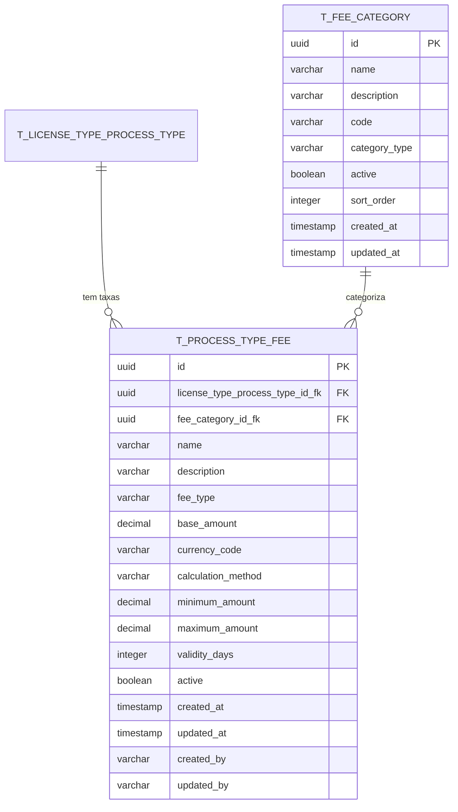

# PR01.05-BE-LIC-Dossier Tipo Licença - Associação Taxas

## 1. Visão Geral

Este documento especifica a implementação do módulo de **Associação de Taxas por Tipo de Processo** para o Sistema de Licenciamento de Cabo Verde. O módulo é responsável pela gestão das taxas associadas aos diferentes tipos de processos de licenciamento, permitindo a parametrização flexível de valores, categorias e regras de cobrança.

### 1.1 Objetivos

* Normalizar o modelo de dados para associação de taxas por tipo de processo

* Implementar arquitetura DDD para gestão de taxas de licenciamento

* Fornecer APIs REST para CRUD de taxas com filtros avançados

* Integrar com módulos de tipos de licenças e processos existentes

* Garantir validações robustas e integridade referencial

* Suportar múltiplas categorias de taxas e regras de cálculo

* Implementar sistema de auditoria completo para alterações de taxas

## 2. Modelo de Dados Normalizado

### 2.1 Diagrama ER

> **Nota**: Este diagrama mostra apenas as novas tabelas específicas para associação de taxas. As tabelas `T_LICENSE_TYPE` e `T_LICENSE_TYPE_PROCESS_TYPE` estão definidas nos documentos `PR01-BE-LIC-Parametrizacao-Licenciamento-Sector-Categoria-Tipos-Licencas.md` e `PR01.04-BE-LIC-Dossier-Tipo-Licenca-Associacao-Tipo-Processos.md` respectivamente.



### 5.3 DTOs e Request/Response Objects

```java
// Request DTOs
public record CreateProcessTypeFeeRequest(
    @NotNull @NotBlank String licenseTypeProcessTypeId,
    @NotNull @NotBlank String feeCategoryId,
    @NotNull @NotBlank @Size(max = 255) String name,
    @Size(max = 1000) String description,
    @NotNull @Pattern(regexp = "FIXED|PERCENTAGE|VARIABLE|TIERED") String feeType,
    @NotNull @DecimalMin("0.00") @Digits(integer = 13, fraction = 2) BigDecimal baseAmount,
    @NotNull @Pattern(regexp = "CVE|EUR|USD") String currencyCode,
    @NotNull @Pattern(regexp = "FIXED|PERCENTAGE|FORMULA|LOOKUP_TABLE") String calculationMethod
) {}

public record UpdateProcessTypeFeeRequest(
    @NotNull @NotBlank @Size(max = 255) String name,
    @Size(max = 1000) String description,
    @NotNull @Pattern(regexp = "FIXED|PERCENTAGE|VARIABLE|TIERED") String feeType,
    @NotNull @DecimalMin("0.00") @Digits(integer = 13, fraction = 2) BigDecimal baseAmount,
    @NotNull @Pattern(regexp = "CVE|EUR|USD") String currencyCode,
    @NotNull @Pattern(regexp = "FIXED|PERCENTAGE|FORMULA|LOOKUP_TABLE") String calculationMethod,
    @DecimalMin("0.00") @Digits(integer = 13, fraction = 2) BigDecimal minimumAmount,
    @DecimalMin("0.00") @Digits(integer = 13, fraction = 2) BigDecimal maximumAmount,
    @Min(1) @Max(3650) Integer validityDays
) {}

public record CreateFeeCategoryRequest(
    @NotNull @NotBlank @Size(max = 100) String name,
    @Size(max = 1000) String description,
    @NotNull @NotBlank @Size(max = 20) @Pattern(regexp = "[A-Z0-9_]+") String code,
    @NotNull @Pattern(regexp = "ADMINISTRATIVE|INSPECTION|PROCESSING|RENEWAL|PENALTY|OTHER") String categoryType,
    @Min(1) @Max(999) Integer sortOrder
) {}

public record UpdateFeeCategoryRequest(
    @NotNull @NotBlank @Size(max = 100) String name,
    @Size(max = 1000) String description,
    @NotNull @Pattern(regexp = "ADMINISTRATIVE|INSPECTION|PROCESSING|RENEWAL|PENALTY|OTHER") String categoryType,
    @Min(1) @Max(999) Integer sortOrder
) {}

public record FeeCalculationRequest(
    @NotNull @NotBlank String licenseTypeProcessTypeId,
    @NotNull Map<String, Object> calculationParameters
) {}

// Response DTOs
public record ProcessTypeFeeResponse(
    String id,
    String licenseTypeProcessTypeId,
    String feeCategoryId,
    String name,
    String description,
    String feeType,
    BigDecimal baseAmount,
    String currencyCode,
    String calculationMethod,
    BigDecimal minimumAmount,
    BigDecimal maximumAmount,
    Integer validityDays,
    Boolean active,
    FeeCategoryResponse feeCategory,
    Instant createdAt,
    Instant updatedAt
) {}

public record FeeCategoryResponse(
    String id,
    String name,
    String description,
    String code,
    String categoryType,
    Boolean active,
    Integer sortOrder,
    Instant createdAt
) {}

public record FeeCalculationResponse(
    BigDecimal totalAmount,
    String currencyCode,
    LocalDateTime calculationDate,
    List<FeeCalculationDetailResponse> feeDetails
) {}

public record FeeCalculationDetailResponse(
    String feeId,
    String feeName,
    String feeType,
    BigDecimal amount,
    String calculationMethod
) {}
```

### 5.4 Query Services

```java
@Service
@Transactional(readOnly = true)
public class ProcessTypeFeeQueryService {
    
    private final ProcessTypeFeeRepository repository;
    private final FeeCategoryRepository feeCategoryRepository;
    
    public ProcessTypeFeeQueryService(
            ProcessTypeFeeRepository repository,
            FeeCategoryRepository feeCategoryRepository) {
        this.repository = repository;
        this.feeCategoryRepository = feeCategoryRepository;
    }
    
    public Optional<ProcessTypeFeeResponse> findById(String id) {
        return repository.findById(ProcessTypeFeeId.of(id))
            .map(this::toResponse);
    }
    
    public Page<ProcessTypeFeeResponse> findAll(
            String licenseTypeProcessTypeId,
            String feeCategoryId,
            String feeType,
            Boolean active,
            Pageable pageable) {
        
        Specification<ProcessTypeFee> spec = Specification.where(null);
        
        if (licenseTypeProcessTypeId != null) {
            spec = spec.and((root, query, cb) -> 
                cb.equal(root.get("licenseTypeProcessTypeId"), 
                        LicenseTypeProcessTypeId.of(licenseTypeProcessTypeId)));
        }
        
        if (feeCategoryId != null) {
            spec = spec.and((root, query, cb) -> 
                cb.equal(root.get("feeCategoryId"), 
                        FeeCategoryId.of(feeCategoryId)));
        }
        
        if (feeType != null) {
            spec = spec.and((root, query, cb) -> 
                cb.equal(root.get("feeType"), feeType));
        }
        
        if (active != null) {
            spec = spec.and((root, query, cb) -> 
                cb.equal(root.get("active"), active));
        }
        
        return repository.findAll(spec, pageable)
            .map(this::toResponse);
    }
    
    private ProcessTypeFeeResponse toResponse(ProcessTypeFee fee) {
        FeeCategoryResponse categoryResponse = feeCategoryRepository
            .findById(fee.getFeeCategoryId())
            .map(this::toCategoryResponse)
            .orElse(null);
        
        return new ProcessTypeFeeResponse(
            fee.getId().getValue().toString(),
            fee.getLicenseTypeProcessTypeId().getValue().toString(),
            fee.getFeeCategoryId().getValue().toString(),
            fee.getName(),
            fee.getDescription(),
            fee.getFeeType(),
            fee.getBaseAmount(),
            fee.getCurrencyCode(),
            fee.getCalculationMethod(),
            fee.getMinimumAmount(),
            fee.getMaximumAmount(),
            fee.getValidityDays(),
            fee.getActive(),
            categoryResponse,
            fee.getCreatedAt(),
            fee.getUpdatedAt()
        );
    }
    
    private FeeCategoryResponse toCategoryResponse(FeeCategory category) {
        return new FeeCategoryResponse(
            category.getId().getValue().toString(),
            category.getName(),
            category.getDescription(),
            category.getCode(),
            category.getCategoryType(),
            category.getActive(),
            category.getSortOrder(),
            category.getCreatedAt()
        );
    }
}

@Service
@Transactional(readOnly = true)
public class FeeCategoryQueryService {
    
    private final FeeCategoryRepository repository;
    
    public FeeCategoryQueryService(FeeCategoryRepository repository) {
        this.repository = repository;
    }
    
    public Optional<FeeCategoryResponse> findById(String id) {
        return repository.findById(FeeCategoryId.of(id))
            .map(this::toResponse);
    }
    
    public Page<FeeCategoryResponse> findAll(
            String categoryType,
            Boolean active,
            Pageable pageable) {
        
        Specification<FeeCategory> spec = Specification.where(null);
        
        if (categoryType != null) {
            spec = spec.and((root, query, cb) -> 
                cb.equal(root.get("categoryType"), categoryType));
        }
        
        if (active != null) {
            spec = spec.and((root, query, cb) -> 
                cb.equal(root.get("active"), active));
        }
        
        return repository.findAll(spec, pageable)
            .map(this::toResponse);
    }
    
    public List<FeeCategoryResponse> findAllActive() {
        return repository.findByActiveTrueOrderBySortOrderAsc()
            .stream()
            .map(this::toResponse)
            .collect(Collectors.toList());
    }
    
    private FeeCategoryResponse toResponse(FeeCategory category) {
        return new FeeCategoryResponse(
            category.getId().getValue().toString(),
            category.getName(),
            category.getDescription(),
            category.getCode(),
            category.getCategoryType(),
            category.getActive(),
            category.getSortOrder(),
            category.getCreatedAt()
        );
    }
}
```

## 6. Regras de Negócio

### 6.1 Validações de Domínio

1. **Unicidade de Nome por Processo**: Cada tipo de processo pode ter apenas uma taxa com o mesmo nome
2. **Validação de Moeda**: Apenas CVE, EUR e USD são aceites como moedas válidas
3. **Consistência de Valores**: O valor mínimo não pode ser superior ao valor máximo
4. **Combinações Válidas**: Tipos de taxa e métodos de cálculo devem ser compatíveis
5. **Categoria Ativa**: Apenas categorias ativas podem ser associadas a novas taxas
6. **Integridade Referencial**: Não é possível eliminar categorias com taxas associadas

### 6.2 Regras de Cálculo

1. **Taxa Fixa**: Valor fixo independente de parâmetros externos
2. **Taxa Percentual**: Calculada como percentagem de um valor base
3. **Taxa Variável**: Calculada através de fórmula ou tabela de consulta
4. **Taxa Escalonada**: Diferentes valores baseados em escalões predefinidos

### 6.3 Regras de Ativação/Desativação

1. **Desativação de Taxa**: Taxa desativada não é incluída em cálculos futuros
2. **Desativação de Categoria**: Categoria desativada não aceita novas taxas
3. **Auditoria**: Todas as alterações de estado são registadas com utilizador e timestamp

## 7. Integração com Outros Módulos

### 7.1 Dependências

* **PR01.04 - Tipos de Processo**: Referência aos tipos de processo de licenciamento

* **PR01 - Tipos de Licença**: Integração com categorias e setores de licenciamento

* **Sistema de Utilizadores**: Auditoria de criação e modificação

* **Sistema de Pagamentos**: Cálculo de taxas para processamento de pagamentos

### 7.2 Eventos de Domínio

```java
public record ProcessTypeFeeCreatedEvent(
    ProcessTypeFeeId feeId,
    LicenseTypeProcessTypeId processTypeId,
    String feeName,
    Money baseAmount,
    Instant occurredAt
) implements DomainEvent {}

public record ProcessTypeFeeUpdatedEvent(
    ProcessTypeFeeId feeId,
    String previousName,
    String newName,
    Money previousAmount,
    Money newAmount,
    Instant occurredAt
) implements DomainEvent {}

public record ProcessTypeFeeActivatedEvent(
    ProcessTypeFeeId feeId,
    Instant occurredAt
) implements DomainEvent {}

public record ProcessTypeFeeDeactivatedEvent(
    ProcessTypeFeeId feeId,
    Instant occurredAt
) implements DomainEvent {}
```

### 7.3 Integração com Sistema de Pagamentos

```java
@Component
public class PaymentIntegrationService {
    
    private final ProcessTypeFeeApplicationService feeService;
    
    public PaymentCalculationResult calculatePaymentAmount(
            String licenseTypeProcessTypeId,
            Map<String, Object> applicationData) {
        
        Money totalFees = feeService.calculateTotalFees(
            licenseTypeProcessTypeId, applicationData);
        
        List<FeeCalculationResult> feeDetails = feeService.calculateFeesWithDetails(
            licenseTypeProcessTypeId, applicationData);
        
        return new PaymentCalculationResult(
            totalFees,
            feeDetails,
            LocalDateTime.now()
        );
    }
}
```

## 8. Considerações de Segurança

### 8.1 Autorização

* **Criação/Edição**: Apenas utilizadores com perfil administrativo

* **Consulta**: Todos os utilizadores autenticados

* **Eliminação**: Apenas super-administradores

* **Cálculo**: Disponível para utilizadores do sistema de licenciamento

### 8.2 Validação de Entrada

* Validação de todos os parâmetros de entrada

* Sanitização de strings para prevenir injeção

* Validação de tipos de dados e formatos

* Verificação de limites de valores monetários

### 8.3 Auditoria

* Registo completo de todas as operações CRUD

* Tracking de alterações de valores de taxas

* Identificação do utilizador responsável por cada alteração

* Timestamp preciso de todas as operações

## 9. Testes

### 9.1 Testes Unitários

```java
@ExtendWith(MockitoExtension.class)
class ProcessTypeFeeTest {
    
    @Mock
    private FeeValidator feeValidator;
    
    @Test
    void shouldCreateProcessTypeFeeWithValidData() {
        // Given
        when(feeValidator.isValidFeeConfiguration(any(), any(), any()))
            .thenReturn(true);
        
        // When
        ProcessTypeFee fee = ProcessTypeFee.create(
            LicenseTypeProcessTypeId.generate(),
            FeeCategoryId.generate(),
            "Taxa Teste",
            "Descrição teste",
            FeeType.FIXED,
            Money.cvEscudos(new BigDecimal("1000.00")),
            CalculationMethod.FIXED,
            "test-user",
            feeValidator
        );
        
        // Then
        assertThat(fee.getName()).isEqualTo("Taxa Teste");
        assertThat(fee.getBaseAmount()).isEqualTo(new BigDecimal("1000.00"));
        assertThat(fee.getActive()).isTrue();
    }
    
    @Test
    void shouldThrowExceptionWhenCreatingFeeWithInvalidData() {
        // Given
        when(feeValidator.isValidFeeConfiguration(any(), any(), any()))
            .thenReturn(false);
        
        // When & Then
        assertThatThrownBy(() -> ProcessTypeFee.create(
            LicenseTypeProcessTypeId.generate(),
            FeeCategoryId.generate(),
            "Taxa Teste",
            "Descrição teste",
            FeeType.FIXED,
            Money.cvEscudos(new BigDecimal("1000.00")),
            CalculationMethod.PERCENTAGE, // Incompatível com FIXED
            "test-user",
            feeValidator
        )).isInstanceOf(IllegalArgumentException.class)
          .hasMessageContaining("Invalid fee configuration");
    }
}
```

### 9.2 Testes de Integração

```java
@SpringBootTest
@Transactional
class ProcessTypeFeeIntegrationTest {
    
    @Autowired
    private ProcessTypeFeeApplicationService applicationService;
    
    @Autowired
    private TestEntityManager entityManager;
    
    @Test
    void shouldCreateAndRetrieveProcessTypeFee() {
        // Given
        CreateProcessTypeFeeCommand command = new CreateProcessTypeFeeCommand(
            UUID.randomUUID().toString(),
            UUID.randomUUID().toString(),
            "Taxa Integração",
            "Teste de integração",
            "FIXED",
            new BigDecimal("2000.00"),
            "CVE",
            "FIXED",
            "test-user"
        );
        
        // When
        ProcessTypeFeeId feeId = applicationService.createFee(command);
        
        // Then
        Optional<ProcessTypeFee> retrievedFee = applicationService.findById(
            feeId.getValue().toString());
        
        assertThat(retrievedFee).isPresent();
        assertThat(retrievedFee.get().getName()).isEqualTo("Taxa Integração");
    }
}
```

## 10. Considerações de Performance

### 10.1 Otimizações de Base de Dados

* Índices em campos frequentemente consultados

* Paginação obrigatória em listagens

* Cache de categorias de taxas (dados relativamente estáticos)

* Queries otimizadas para cálculos de taxas

### 10.2 Cache Strategy

```java
@Service
public class FeeCategoryCache {
    
    @Cacheable(value = "fee-categories", key = "'active'")
    public List<FeeCategoryResponse> getActiveCategories() {
        return feeCategoryQueryService.findAllActive();
    }
    
    @CacheEvict(value = "fee-categories", allEntries = true)
    public void evictCache() {
        // Cache invalidation when categories are modified
    }
}
```

## 11. Monitorização e Logging

### 11.1 Métricas

* Número de taxas criadas por dia

* Tempo médio de cálculo de taxas

* Taxas mais utilizadas

* Erros de validação mais frequentes

### 11.2 Logging

```java
@Slf4j
@Component
public class FeeAuditLogger {
    
    public void logFeeCreation(ProcessTypeFeeId feeId, String createdBy) {
        log.info("Fee created: id={}, createdBy={}", feeId.getValue(), createdBy);
    }
    
    public void logFeeCalculation(String processTypeId, Money totalAmount) {
        log.info("Fee calculation: processType={}, total={} {}", 
                processTypeId, totalAmount.getAmount(), totalAmount.getCurrency());
    }
    
    public void logFeeValidationError(String error, String context) {
        log.warn("Fee validation error: {} in context: {}", error, context);
    }
}
```

## 12. Roadmap e Melhorias Futuras

### 12.1 Funcionalidades Planeadas

1. **Histórico de Taxas**: Manter histórico de alterações de valores
2. **Taxas Condicionais**: Taxas baseadas em condições complexas
3. **Descontos e Promoções**: Sistema de descontos automáticos
4. **Integração com Câmbio**: Conversão automática de moedas
5. **Dashboard de Análise**: Relatórios e análises de taxas

### 12.2 Otimizações Técnicas

1. **Event Sourcing**: Para auditoria completa de alterações
2. **CQRS**: Separação de comandos e consultas
3. **Microserviços**: Separação em serviço independente
4. **GraphQL**: API mais flexível para consultas

***

**Documento**: PR01.05-BE-LIC-Dossier-Tipo-Licenca-Associacao-Taxas\
**Versão**: 1.0\
**Data**: Janeiro 2024\
**Autor**: Sistema de Licenciamento - Cabo Verde

```
T_FEE_CATEGORY {
    uuid id PK
    varchar name
    varchar description
    varchar code
    varchar category_type
    boolean active
    integer sort_order
    timestamp created_at
    timestamp updated_at
    varchar created_by
    varchar updated_by
}


```

````

### 2.2 Definição da Tabela T\_PROCESS\_TYPE\_FEE

```sql
CREATE TABLE t_process_type_fee (
    id UUID PRIMARY KEY DEFAULT gen_random_uuid(),
    license_type_process_type_id_fk UUID NOT NULL,
    fee_category_id_fk UUID NOT NULL,
    name VARCHAR(255) NOT NULL,
    description TEXT,
    fee_type VARCHAR(50) NOT NULL DEFAULT 'FIXED',
    base_amount DECIMAL(15,2) NOT NULL DEFAULT 0.00,
    currency_code VARCHAR(3) NOT NULL DEFAULT 'CVE',
    calculation_method VARCHAR(50) NOT NULL DEFAULT 'FIXED',
    minimum_amount DECIMAL(15,2),
    maximum_amount DECIMAL(15,2),
    validity_days INTEGER,
    active BOOLEAN NOT NULL DEFAULT TRUE,
    created_at TIMESTAMP WITH TIME ZONE NOT NULL DEFAULT NOW(),
    updated_at TIMESTAMP WITH TIME ZONE NOT NULL DEFAULT NOW(),
    created_by VARCHAR(100) NOT NULL,
    updated_by VARCHAR(100) NOT NULL,
    
    CONSTRAINT fk_process_type_fee_license_type_process_type 
        FOREIGN KEY (license_type_process_type_id_fk) 
        REFERENCES t_license_type_process_type(id) ON DELETE CASCADE,
    CONSTRAINT fk_process_type_fee_category 
        FOREIGN KEY (fee_category_id_fk) 
        REFERENCES t_fee_category(id) ON DELETE RESTRICT,
    CONSTRAINT chk_process_type_fee_name_not_empty 
        CHECK (LENGTH(TRIM(name)) > 0),
    CONSTRAINT chk_process_type_fee_base_amount_positive 
        CHECK (base_amount >= 0),
    CONSTRAINT chk_process_type_fee_type 
        CHECK (fee_type IN ('FIXED', 'PERCENTAGE', 'VARIABLE', 'TIERED')),
    CONSTRAINT chk_process_type_fee_calculation_method 
        CHECK (calculation_method IN ('FIXED', 'PERCENTAGE', 'FORMULA', 'LOOKUP_TABLE')),
    CONSTRAINT chk_process_type_fee_currency 
        CHECK (currency_code IN ('CVE', 'EUR', 'USD')),
    CONSTRAINT chk_process_type_fee_amount_range 
        CHECK (minimum_amount IS NULL OR maximum_amount IS NULL OR minimum_amount <= maximum_amount),
    CONSTRAINT uq_process_type_fee_name_process 
        UNIQUE (license_type_process_type_id_fk, name)
);
````

### 2.3 Definição da Tabela T\_FEE\_CATEGORY

```sql
CREATE TABLE t_fee_category (
    id UUID PRIMARY KEY DEFAULT gen_random_uuid(),
    name VARCHAR(100) NOT NULL,
    description TEXT,
    code VARCHAR(20) UNIQUE NOT NULL,
    category_type VARCHAR(50) NOT NULL DEFAULT 'ADMINISTRATIVE',
    active BOOLEAN NOT NULL DEFAULT TRUE,
    sort_order INTEGER,
    created_at TIMESTAMP WITH TIME ZONE NOT NULL DEFAULT NOW(),
    updated_at TIMESTAMP WITH TIME ZONE NOT NULL DEFAULT NOW(),
    created_by VARCHAR(100) NOT NULL,
    updated_by VARCHAR(100) NOT NULL,
    
    CONSTRAINT chk_fee_category_name_not_empty 
        CHECK (LENGTH(TRIM(name)) > 0),
    CONSTRAINT chk_fee_category_code_not_empty 
        CHECK (LENGTH(TRIM(code)) > 0),
    CONSTRAINT chk_fee_category_type 
        CHECK (category_type IN ('ADMINISTRATIVE', 'INSPECTION', 'PROCESSING', 'RENEWAL', 'PENALTY', 'OTHER'))
);
```

### 2.4 Índices

```sql
-- Índices para T_PROCESS_TYPE_FEE
CREATE INDEX idx_process_type_fee_license_type_process ON t_process_type_fee(license_type_process_type_id_fk);
CREATE INDEX idx_process_type_fee_category ON t_process_type_fee(fee_category_id_fk);
CREATE INDEX idx_process_type_fee_active ON t_process_type_fee(active) WHERE active = TRUE;
CREATE INDEX idx_process_type_fee_fee_type ON t_process_type_fee(fee_type);
CREATE INDEX idx_process_type_fee_amount ON t_process_type_fee(base_amount);
CREATE INDEX idx_process_type_fee_created_at ON t_process_type_fee(created_at DESC);
CREATE INDEX idx_process_type_fee_name_search ON t_process_type_fee USING gin(to_tsvector('portuguese', name));

-- Índices para T_FEE_CATEGORY
CREATE INDEX idx_fee_category_code ON t_fee_category(code);
CREATE INDEX idx_fee_category_type ON t_fee_category(category_type);
CREATE INDEX idx_fee_category_active ON t_fee_category(active) WHERE active = TRUE;
CREATE INDEX idx_fee_category_sort_order ON t_fee_category(sort_order NULLS LAST);
```

### 2.5 Dados Iniciais para Categorias de Taxas

```sql
-- Inserir categorias de taxas baseadas no sistema legacy
INSERT INTO t_fee_category (name, description, code, category_type, sort_order, created_by, updated_by) VALUES
('Taxa de Processamento', 'Taxa básica para processamento do pedido de licença', 'PROC', 'PROCESSING', 1, 'SYSTEM', 'SYSTEM'),
('Taxa de Inspeção', 'Taxa para inspeções técnicas obrigatórias', 'INSP', 'INSPECTION', 2, 'SYSTEM', 'SYSTEM'),
('Taxa Administrativa', 'Taxa para serviços administrativos', 'ADM', 'ADMINISTRATIVE', 3, 'SYSTEM', 'SYSTEM'),
('Taxa de Renovação', 'Taxa para renovação de licenças', 'REN', 'RENEWAL', 4, 'SYSTEM', 'SYSTEM'),
('Taxa de Urgência', 'Taxa adicional para processamento urgente', 'URG', 'PROCESSING', 5, 'SYSTEM', 'SYSTEM'),
('Taxa de Penalização', 'Taxa aplicada por infrações ou atrasos', 'PEN', 'PENALTY', 6, 'SYSTEM', 'SYSTEM'),
('Taxa de Vistoria', 'Taxa para vistorias técnicas especializadas', 'VIST', 'INSPECTION', 7, 'SYSTEM', 'SYSTEM'),
('Taxa de Emissão', 'Taxa para emissão de documentos oficiais', 'EMIS', 'ADMINISTRATIVE', 8, 'SYSTEM', 'SYSTEM');
```

## 3. Arquitetura DDD

### 3.1 Domain Layer

#### 3.1.1 Aggregate Root: ProcessTypeFee

```java
@Entity
@Table(name = "t_process_type_fee")
public class ProcessTypeFee {
    @Id
    private ProcessTypeFeeId id;
    
    @Column(name = "license_type_process_type_id_fk", nullable = false)
    private LicenseTypeProcessTypeId licenseTypeProcessTypeId;
    
    @Column(name = "fee_category_id_fk", nullable = false)
    private FeeCategoryId feeCategoryId;
    
    @Column(name = "name", nullable = false, length = 255)
    private String name;
    
    @Column(name = "description")
    private String description;
    
    @Column(name = "fee_type", nullable = false)
    private String feeType;
    
    @Column(name = "base_amount", nullable = false, precision = 15, scale = 2)
    private BigDecimal baseAmount;
    
    @Column(name = "currency_code", nullable = false, length = 3)
    private String currencyCode;
    
    @Column(name = "calculation_method", nullable = false)
    private String calculationMethod;
    
    @Column(name = "minimum_amount", precision = 15, scale = 2)
    private BigDecimal minimumAmount;
    
    @Column(name = "maximum_amount", precision = 15, scale = 2)
    private BigDecimal maximumAmount;
    
    @Column(name = "validity_days")
    private Integer validityDays;
    
    @Column(name = "active", nullable = false)
    private Boolean active;
    
    // Campos de auditoria
    @Column(name = "created_at", nullable = false)
    private Instant createdAt;
    
    @Column(name = "updated_at", nullable = false)
    private Instant updatedAt;
    
    @Column(name = "created_by", nullable = false)
    private String createdBy;
    
    @Column(name = "updated_by", nullable = false)
    private String updatedBy;
    
    // Métodos de negócio
    public static ProcessTypeFee create(
            LicenseTypeProcessTypeId licenseTypeProcessTypeId,
            FeeCategoryId feeCategoryId,
            String name,
            String description,
            FeeType feeType,
            Money baseAmount,
            CalculationMethod calculationMethod,
            String createdBy,
            FeeValidator feeValidator) {
        
        validateCreationParameters(licenseTypeProcessTypeId, feeCategoryId, name, 
                                 feeType, baseAmount, calculationMethod, createdBy, feeValidator);
        
        return new ProcessTypeFee(
            ProcessTypeFeeId.generate(),
            licenseTypeProcessTypeId,
            feeCategoryId,
            name.trim(),
            description != null ? description.trim() : null,
            feeType.getValue(),
            baseAmount.getAmount(),
            baseAmount.getCurrency().getCurrencyCode(),
            calculationMethod.getValue(),
            null,
            null,
            null,
            true,
            createdBy
        );
    }
    
    public void updateFeeConfiguration(
            String name,
            String description,
            FeeType feeType,
            Money baseAmount,
            CalculationMethod calculationMethod,
            Money minimumAmount,
            Money maximumAmount,
            Integer validityDays,
            String updatedBy,
            FeeValidator feeValidator) {
        
        validateUpdateParameters(name, feeType, baseAmount, calculationMethod, 
                               minimumAmount, maximumAmount, updatedBy, feeValidator);
        
        this.name = name.trim();
        this.description = description != null ? description.trim() : null;
        this.feeType = feeType.getValue();
        this.baseAmount = baseAmount.getAmount();
        this.currencyCode = baseAmount.getCurrency().getCurrencyCode();
        this.calculationMethod = calculationMethod.getValue();
        this.minimumAmount = minimumAmount != null ? minimumAmount.getAmount() : null;
        this.maximumAmount = maximumAmount != null ? maximumAmount.getAmount() : null;
        this.validityDays = validityDays;
        this.updatedBy = updatedBy;
        this.updatedAt = Instant.now();
    }
    
    public void activate(String updatedBy) {
        this.active = true;
        this.updatedBy = updatedBy;
        this.updatedAt = Instant.now();
    }
    
    public void deactivate(String updatedBy) {
        this.active = false;
        this.updatedBy = updatedBy;
        this.updatedAt = Instant.now();
    }
    
    public Money calculateFee(FeeCalculationContext context) {
        FeeCalculationMethod method = FeeCalculationMethodFactory.create(this.calculationMethod);
        return method.calculate(this, context);
    }
    
    // Métodos de validação
    private static void validateCreationParameters(
            LicenseTypeProcessTypeId licenseTypeProcessTypeId,
            FeeCategoryId feeCategoryId,
            String name,
            FeeType feeType,
            Money baseAmount,
            CalculationMethod calculationMethod,
            String createdBy,
            FeeValidator feeValidator) {
        
        if (licenseTypeProcessTypeId == null) {
            throw new IllegalArgumentException("License type process type ID cannot be null");
        }
        
        if (feeCategoryId == null) {
            throw new IllegalArgumentException("Fee category ID cannot be null");
        }
        
        if (name == null || name.trim().isEmpty()) {
            throw new IllegalArgumentException("Fee name cannot be null or empty");
        }
        
        if (name.trim().length() > 255) {
            throw new IllegalArgumentException("Fee name cannot exceed 255 characters");
        }
        
        if (feeType == null) {
            throw new IllegalArgumentException("Fee type cannot be null");
        }
        
        if (baseAmount == null) {
            throw new IllegalArgumentException("Base amount cannot be null");
        }
        
        if (baseAmount.getAmount().compareTo(BigDecimal.ZERO) < 0) {
            throw new IllegalArgumentException("Base amount cannot be negative");
        }
        
        if (calculationMethod == null) {
            throw new IllegalArgumentException("Calculation method cannot be null");
        }
        
        if (createdBy == null || createdBy.trim().isEmpty()) {
            throw new IllegalArgumentException("Created by cannot be null or empty");
        }
        
        if (!feeValidator.isValidFeeConfiguration(feeType, calculationMethod, baseAmount)) {
            throw new IllegalArgumentException("Invalid fee configuration");
        }
    }
    
    private static void validateUpdateParameters(
            String name,
            FeeType feeType,
            Money baseAmount,
            CalculationMethod calculationMethod,
            Money minimumAmount,
            Money maximumAmount,
            String updatedBy,
            FeeValidator feeValidator) {
        
        if (name == null || name.trim().isEmpty()) {
            throw new IllegalArgumentException("Fee name cannot be null or empty");
        }
        
        if (name.trim().length() > 255) {
            throw new IllegalArgumentException("Fee name cannot exceed 255 characters");
        }
        
        if (feeType == null) {
            throw new IllegalArgumentException("Fee type cannot be null");
        }
        
        if (baseAmount == null) {
            throw new IllegalArgumentException("Base amount cannot be null");
        }
        
        if (baseAmount.getAmount().compareTo(BigDecimal.ZERO) < 0) {
            throw new IllegalArgumentException("Base amount cannot be negative");
        }
        
        if (calculationMethod == null) {
            throw new IllegalArgumentException("Calculation method cannot be null");
        }
        
        if (minimumAmount != null && maximumAmount != null && 
            minimumAmount.getAmount().compareTo(maximumAmount.getAmount()) > 0) {
            throw new IllegalArgumentException("Minimum amount cannot be greater than maximum amount");
        }
        
        if (updatedBy == null || updatedBy.trim().isEmpty()) {
            throw new IllegalArgumentException("Updated by cannot be null or empty");
        }
        
        if (!feeValidator.isValidFeeConfiguration(feeType, calculationMethod, baseAmount)) {
            throw new IllegalArgumentException("Invalid fee configuration");
        }
    }
    
    // Getters
    public ProcessTypeFeeId getId() { return id; }
    public LicenseTypeProcessTypeId getLicenseTypeProcessTypeId() { return licenseTypeProcessTypeId; }
    public FeeCategoryId getFeeCategoryId() { return feeCategoryId; }
    public String getName() { return name; }
    public String getDescription() { return description; }
    public String getFeeType() { return feeType; }
    public BigDecimal getBaseAmount() { return baseAmount; }
    public String getCurrencyCode() { return currencyCode; }
    public String getCalculationMethod() { return calculationMethod; }
    public BigDecimal getMinimumAmount() { return minimumAmount; }
    public BigDecimal getMaximumAmount() { return maximumAmount; }
    public Integer getValidityDays() { return validityDays; }
    public Boolean getActive() { return active; }
    public Instant getCreatedAt() { return createdAt; }
    public Instant getUpdatedAt() { return updatedAt; }
    public String getCreatedBy() { return createdBy; }
    public String getUpdatedBy() { return updatedBy; }
}
```

#### 3.1.2 Aggregate Root: FeeCategory

```java
@Entity
@Table(name = "t_fee_category")
public class FeeCategory {
    @Id
    private FeeCategoryId id;
    
    @Column(name = "name", nullable = false, length = 100)
    private String name;
    
    @Column(name = "description")
    private String description;
    
    @Column(name = "code", nullable = false, length = 20)
    private String code;
    
    @Column(name = "category_type", nullable = false)
    private String categoryType;
    
    @Column(name = "active", nullable = false)
    private Boolean active;
    
    @Column(name = "sort_order")
    private Integer sortOrder;
    
    // Campos de auditoria
    @Column(name = "created_at", nullable = false)
    private Instant createdAt;
    
    @Column(name = "updated_at", nullable = false)
    private Instant updatedAt;
    
    @Column(name = "created_by", nullable = false)
    private String createdBy;
    
    @Column(name = "updated_by", nullable = false)
    private String updatedBy;
    
    // Factory method
    public static FeeCategory create(
            String name,
            String description,
            String code,
            FeeCategoryType categoryType,
            Integer sortOrder,
            String createdBy) {
        
        validateCreationParameters(name, code, categoryType, createdBy);
        
        return new FeeCategory(
            FeeCategoryId.generate(),
            name.trim(),
            description != null ? description.trim() : null,
            code.trim().toUpperCase(),
            categoryType.getValue(),
            true,
            sortOrder,
            createdBy
        );
    }
    
    // Business methods
    public void updateInfo(
            String name,
            String description,
            FeeCategoryType categoryType,
            Integer sortOrder,
            String updatedBy) {
        
        validateUpdateParameters(name, categoryType, updatedBy);
        
        this.name = name.trim();
        this.description = description != null ? description.trim() : null;
        this.categoryType = categoryType.getValue();
        this.sortOrder = sortOrder;
        this.updatedBy = updatedBy;
        this.updatedAt = Instant.now();
    }
    
    public void activate(String updatedBy) {
        this.active = true;
        this.updatedBy = updatedBy;
        this.updatedAt = Instant.now();
    }
    
    public void deactivate(String updatedBy) {
        this.active = false;
        this.updatedBy = updatedBy;
        this.updatedAt = Instant.now();
    }
    
    // Validation methods
    private static void validateCreationParameters(
            String name,
            String code,
            FeeCategoryType categoryType,
            String createdBy) {
        
        if (name == null || name.trim().isEmpty()) {
            throw new IllegalArgumentException("Category name cannot be null or empty");
        }
        
        if (name.trim().length() > 100) {
            throw new IllegalArgumentException("Category name cannot exceed 100 characters");
        }
        
        if (code == null || code.trim().isEmpty()) {
            throw new IllegalArgumentException("Category code cannot be null or empty");
        }
        
        if (code.trim().length() > 20) {
            throw new IllegalArgumentException("Category code cannot exceed 20 characters");
        }
        
        if (categoryType == null) {
            throw new IllegalArgumentException("Category type cannot be null");
        }
        
        if (createdBy == null || createdBy.trim().isEmpty()) {
            throw new IllegalArgumentException("Created by cannot be null or empty");
        }
    }
    
    private static void validateUpdateParameters(
            String name,
            FeeCategoryType categoryType,
            String updatedBy) {
        
        if (name == null || name.trim().isEmpty()) {
            throw new IllegalArgumentException("Category name cannot be null or empty");
        }
        
        if (name.trim().length() > 100) {
            throw new IllegalArgumentException("Category name cannot exceed 100 characters");
        }
        
        if (categoryType == null) {
            throw new IllegalArgumentException("Category type cannot be null");
        }
        
        if (updatedBy == null || updatedBy.trim().isEmpty()) {
            throw new IllegalArgumentException("Updated by cannot be null or empty");
        }
    }
    
    // Getters
    public FeeCategoryId getId() { return id; }
    public String getName() { return name; }
    public String getDescription() { return description; }
    public String getCode() { return code; }
    public String getCategoryType() { return categoryType; }
    public Boolean getActive() { return active; }
    public Integer getSortOrder() { return sortOrder; }
    public Instant getCreatedAt() { return createdAt; }
    public Instant getUpdatedAt() { return updatedAt; }
    public String getCreatedBy() { return createdBy; }
    public String getUpdatedBy() { return updatedBy; }
}
```

#### 3.1.3 Value Objects

```java
@Embeddable
public class ProcessTypeFeeId {
    @Column(name = "id")
    private UUID value;
    
    public static ProcessTypeFeeId generate() {
        return new ProcessTypeFeeId(UUID.randomUUID());
    }
    
    public static ProcessTypeFeeId of(UUID value) {
        return new ProcessTypeFeeId(value);
    }
    
    public static ProcessTypeFeeId of(String value) {
        return new ProcessTypeFeeId(UUID.fromString(value));
    }
    
    public UUID getValue() { return value; }
}

@Embeddable
public class FeeCategoryId {
    @Column(name = "fee_category_id_fk")
    private UUID value;
    
    public static FeeCategoryId generate() {
        return new FeeCategoryId(UUID.randomUUID());
    }
    
    public static FeeCategoryId of(UUID value) {
        return new FeeCategoryId(value);
    }
    
    public static FeeCategoryId of(String value) {
        return new FeeCategoryId(UUID.fromString(value));
    }
    
    public UUID getValue() { return value; }
}

public class Money {
    private final BigDecimal amount;
    private final Currency currency;
    
    public Money(BigDecimal amount, Currency currency) {
        this.amount = Objects.requireNonNull(amount, "Amount cannot be null");
        this.currency = Objects.requireNonNull(currency, "Currency cannot be null");
        
        if (amount.compareTo(BigDecimal.ZERO) < 0) {
            throw new IllegalArgumentException("Amount cannot be negative");
        }
    }
    
    public static Money of(BigDecimal amount, String currencyCode) {
        return new Money(amount, Currency.getInstance(currencyCode));
    }
    
    public static Money cvEscudos(BigDecimal amount) {
        return new Money(amount, Currency.getInstance("CVE"));
    }
    
    public Money add(Money other) {
        if (!this.currency.equals(other.currency)) {
            throw new IllegalArgumentException("Cannot add different currencies");
        }
        return new Money(this.amount.add(other.amount), this.currency);
    }
    
    public Money multiply(BigDecimal factor) {
        return new Money(this.amount.multiply(factor), this.currency);
    }
    
    public BigDecimal getAmount() { return amount; }
    public Currency getCurrency() { return currency; }
}

public enum FeeType {
    FIXED("FIXED"),
    PERCENTAGE("PERCENTAGE"),
    VARIABLE("VARIABLE"),
    TIERED("TIERED");
    
    private final String value;
    
    FeeType(String value) {
        this.value = value;
    }
    
    public String getValue() { return value; }
    
    public static FeeType fromValue(String value) {
        for (FeeType type : values()) {
            if (type.value.equals(value)) {
                return type;
            }
        }
        throw new IllegalArgumentException("Invalid fee type: " + value);
    }
}

public enum CalculationMethod {
    FIXED("FIXED"),
    PERCENTAGE("PERCENTAGE"),
    FORMULA("FORMULA"),
    LOOKUP_TABLE("LOOKUP_TABLE");
    
    private final String value;
    
    CalculationMethod(String value) {
        this.value = value;
    }
    
    public String getValue() { return value; }
    
    public static CalculationMethod fromValue(String value) {
        for (CalculationMethod method : values()) {
            if (method.value.equals(value)) {
                return method;
            }
        }
        throw new IllegalArgumentException("Invalid calculation method: " + value);
    }
}

public enum FeeCategoryType {
    ADMINISTRATIVE("ADMINISTRATIVE"),
    INSPECTION("INSPECTION"),
    PROCESSING("PROCESSING"),
    RENEWAL("RENEWAL"),
    PENALTY("PENALTY"),
    OTHER("OTHER");
    
    private final String value;
    
    FeeCategoryType(String value) {
        this.value = value;
    }
    
    public String getValue() { return value; }
    
    public static FeeCategoryType fromValue(String value) {
        for (FeeCategoryType type : values()) {
            if (type.value.equals(value)) {
                return type;
            }
        }
        throw new IllegalArgumentException("Invalid fee category type: " + value);
    }
}
```

#### 3.1.4 Domain Services

```java
@Component
public class FeeValidator {
    
    public boolean isValidFeeConfiguration(
            FeeType feeType, 
            CalculationMethod calculationMethod, 
            Money baseAmount) {
        
        // Validar combinações válidas de tipo de taxa e método de cálculo
        switch (feeType) {
            case FIXED:
                return calculationMethod == CalculationMethod.FIXED;
            case PERCENTAGE:
                return calculationMethod == CalculationMethod.PERCENTAGE;
            case VARIABLE:
                return calculationMethod == CalculationMethod.FORMULA || 
                       calculationMethod == CalculationMethod.LOOKUP_TABLE;
            case TIERED:
                return calculationMethod == CalculationMethod.LOOKUP_TABLE;
            default:
                return false;
        }
    }
    
    public boolean isValidAmountRange(Money minimumAmount, Money maximumAmount) {
        if (minimumAmount == null || maximumAmount == null) {
            return true;
        }
        
        if (!minimumAmount.getCurrency().equals(maximumAmount.getCurrency())) {
            return false;
        }
        
        return minimumAmount.getAmount().compareTo(maximumAmount.getAmount()) <= 0;
    }
    
    public boolean isValidCurrency(String currencyCode) {
        try {
            Currency.getInstance(currencyCode);
            return Arrays.asList("CVE", "EUR", "USD").contains(currencyCode);
        } catch (IllegalArgumentException e) {
            return false;
        }
    }
}

@Component
public class FeeCalculationService {
    
    public Money calculateTotalFee(
            List<ProcessTypeFee> fees, 
            FeeCalculationContext context) {
        
        Money total = Money.cvEscudos(BigDecimal.ZERO);
        
        for (ProcessTypeFee fee : fees) {
            if (fee.getActive()) {
                Money feeAmount = fee.calculateFee(context);
                total = total.add(feeAmount);
            }
        }
        
        return total;
    }
    
    public List<FeeCalculationResult> calculateFeesWithDetails(
            List<ProcessTypeFee> fees, 
            FeeCalculationContext context) {
        
        return fees.stream()
                .filter(ProcessTypeFee::getActive)
                .map(fee -> {
                    Money amount = fee.calculateFee(context);
                    return new FeeCalculationResult(
                        fee.getId(),
                        fee.getName(),
                        fee.getFeeType(),
                        amount,
                        context.getCalculationDate()
                    );
                })
                .collect(Collectors.toList());
    }
}

public class FeeCalculationContext {
    private final Map<String, Object> parameters;
    private final LocalDateTime calculationDate;
    private final String currencyCode;
    
    public FeeCalculationContext(Map<String, Object> parameters, String currencyCode) {
        this.parameters = new HashMap<>(parameters);
        this.calculationDate = LocalDateTime.now();
        this.currencyCode = currencyCode;
    }
    
    public <T> T getParameter(String key, Class<T> type) {
        Object value = parameters.get(key);
        if (value == null) {
            return null;
        }
        return type.cast(value);
    }
    
    public void setParameter(String key, Object value) {
        parameters.put(key, value);
    }
    
    public LocalDateTime getCalculationDate() { return calculationDate; }
    public String getCurrencyCode() { return currencyCode; }
    public Map<String, Object> getParameters() { return new HashMap<>(parameters); }
}

public record FeeCalculationResult(
    ProcessTypeFeeId feeId,
    String feeName,
    String feeType,
    Money amount,
    LocalDateTime calculationDate
) {}
```

### 3.2 Application Layer

#### 3.2.1 Application Services

```java
@Service
@Transactional
public class ProcessTypeFeeApplicationService {
    
    private final ProcessTypeFeeRepository repository;
    private final FeeCategoryRepository feeCategoryRepository;
    private final LicenseTypeProcessTypeRepository licenseTypeProcessTypeRepository;
    private final FeeValidator feeValidator;
    private final FeeCalculationService feeCalculationService;
    
    public ProcessTypeFeeApplicationService(
            ProcessTypeFeeRepository repository,
            FeeCategoryRepository feeCategoryRepository,
            LicenseTypeProcessTypeRepository licenseTypeProcessTypeRepository,
            FeeValidator feeValidator,
            FeeCalculationService feeCalculationService) {
        this.repository = repository;
        this.feeCategoryRepository = feeCategoryRepository;
        this.licenseTypeProcessTypeRepository = licenseTypeProcessTypeRepository;
        this.feeValidator = feeValidator;
        this.feeCalculationService = feeCalculationService;
    }
    
    public ProcessTypeFeeId createFee(CreateProcessTypeFeeCommand command) {
        // Validar se o tipo de processo existe
        if (!licenseTypeProcessTypeRepository.existsById(
                LicenseTypeProcessTypeId.of(command.licenseTypeProcessTypeId()))) {
            throw new LicenseTypeProcessTypeNotFoundException(
                "License type process type not found: " + command.licenseTypeProcessTypeId());
        }
        
        // Validar se a categoria existe
        if (!feeCategoryRepository.existsById(
                FeeCategoryId.of(command.feeCategoryId()))) {
            throw new FeeCategoryNotFoundException(
                "Fee category not found: " + command.feeCategoryId());
        }
        
        ProcessTypeFee fee = ProcessTypeFee.create(
            LicenseTypeProcessTypeId.of(command.licenseTypeProcessTypeId()),
            FeeCategoryId.of(command.feeCategoryId()),
            command.name(),
            command.description(),
            FeeType.fromValue(command.feeType()),
            Money.of(command.baseAmount(), command.currencyCode()),
            CalculationMethod.fromValue(command.calculationMethod()),
            command.createdBy(),
            feeValidator
        );
        
        return repository.save(fee).getId();
    }
    
    public void updateFee(UpdateProcessTypeFeeCommand command) {
        ProcessTypeFee fee = repository.findById(
            ProcessTypeFeeId.of(command.id())
        ).orElseThrow(() -> new ProcessTypeFeeNotFoundException(
            "Fee not found with ID: " + command.id()));
        
        Money minimumAmount = command.minimumAmount() != null ? 
            Money.of(command.minimumAmount(), command.currencyCode()) : null;
        Money maximumAmount = command.maximumAmount() != null ? 
            Money.of(command.maximumAmount(), command.currencyCode()) : null;
        
        fee.updateFeeConfiguration(
            command.name(),
            command.description(),
            FeeType.fromValue(command.feeType()),
            Money.of(command.baseAmount(), command.currencyCode()),
            CalculationMethod.fromValue(command.calculationMethod()),
            minimumAmount,
            maximumAmount,
            command.validityDays(),
            command.updatedBy(),
            feeValidator
        );
        
        repository.save(fee);
    }
    
    public void activateFee(ActivateProcessTypeFeeCommand command) {
        ProcessTypeFee fee = repository.findById(
            ProcessTypeFeeId.of(command.id())
        ).orElseThrow(() -> new ProcessTypeFeeNotFoundException(
            "Fee not found with ID: " + command.id()));
        
        fee.activate(command.updatedBy());
        repository.save(fee);
    }
    
    public void deactivateFee(DeactivateProcessTypeFeeCommand command) {
        ProcessTypeFee fee = repository.findById(
            ProcessTypeFeeId.of(command.id())
        ).orElseThrow(() -> new ProcessTypeFeeNotFoundException(
            "Fee not found with ID: " + command.id()));
        
        fee.deactivate(command.updatedBy());
        repository.save(fee);
    }
    
    @Transactional(readOnly = true)
    public Optional<ProcessTypeFee> findById(String id) {
        return repository.findById(ProcessTypeFeeId.of(id));
    }
    
    @Transactional(readOnly = true)
    public List<ProcessTypeFee> findByLicenseTypeProcessTypeId(String licenseTypeProcessTypeId) {
        return repository.findByLicenseTypeProcessTypeId(
            LicenseTypeProcessTypeId.of(licenseTypeProcessTypeId));
    }
    
    @Transactional(readOnly = true)
    public List<ProcessTypeFee> findByFeeCategoryId(String feeCategoryId) {
        return repository.findByFeeCategoryId(FeeCategoryId.of(feeCategoryId));
    }
    
    @Transactional(readOnly = true)
    public Page<ProcessTypeFee> findAll(Pageable pageable) {
        return repository.findAll(pageable);
    }
    
    @Transactional(readOnly = true)
    public Money calculateTotalFees(
            String licenseTypeProcessTypeId, 
            Map<String, Object> calculationParameters) {
        
        List<ProcessTypeFee> fees = repository.findByLicenseTypeProcessTypeIdAndActiveTrue(
            LicenseTypeProcessTypeId.of(licenseTypeProcessTypeId));
        
        FeeCalculationContext context = new FeeCalculationContext(calculationParameters, "CVE");
        return feeCalculationService.calculateTotalFee(fees, context);
    }
    
    @Transactional(readOnly = true)
    public List<FeeCalculationResult> calculateFeesWithDetails(
            String licenseTypeProcessTypeId, 
            Map<String, Object> calculationParameters) {
        
        List<ProcessTypeFee> fees = repository.findByLicenseTypeProcessTypeIdAndActiveTrue(
            LicenseTypeProcessTypeId.of(licenseTypeProcessTypeId));
        
        FeeCalculationContext context = new FeeCalculationContext(calculationParameters, "CVE");
        return feeCalculationService.calculateFeesWithDetails(fees, context);
    }
    
    public void deleteFee(String id) {
        ProcessTypeFeeId feeId = ProcessTypeFeeId.of(id);
        if (!repository.existsById(feeId)) {
            throw new ProcessTypeFeeNotFoundException(
                "Fee not found with ID: " + id);
        }
        repository.deleteById(feeId);
    }
}

@Service
@Transactional
public class FeeCategoryApplicationService {
    
    private final FeeCategoryRepository repository;
    
    public FeeCategoryApplicationService(FeeCategoryRepository repository) {
        this.repository = repository;
    }
    
    public FeeCategoryId createCategory(CreateFeeCategoryCommand command) {
        // Validar unicidade do código
        if (repository.existsByCode(command.code())) {
            throw new FeeCategoryCodeAlreadyExistsException(
                "Fee category code already exists: " + command.code());
        }
        
        FeeCategory category = FeeCategory.create(
            command.name(),
            command.description(),
            command.code(),
            FeeCategoryType.fromValue(command.categoryType()),
            command.sortOrder(),
            command.createdBy()
        );
        
        return repository.save(category).getId();
    }
    
    public void updateCategory(UpdateFeeCategoryCommand command) {
        FeeCategory category = repository.findById(
            FeeCategoryId.of(command.id())
        ).orElseThrow(() -> new FeeCategoryNotFoundException(
            "Fee category not found with ID: " + command.id()));
        
        category.updateInfo(
            command.name(),
            command.description(),
            FeeCategoryType.fromValue(command.categoryType()),
            command.sortOrder(),
            command.updatedBy()
        );
        
        repository.save(category);
    }
    
    public void activateCategory(ActivateFeeCategoryCommand command) {
        FeeCategory category = repository.findById(
            FeeCategoryId.of(command.id())
        ).orElseThrow(() -> new FeeCategoryNotFoundException(
            "Fee category not found with ID: " + command.id()));
        
        category.activate(command.updatedBy());
        repository.save(category);
    }
    
    public void deactivateCategory(DeactivateFeeCategoryCommand command) {
        FeeCategory category = repository.findById(
            FeeCategoryId.of(command.id())
        ).orElseThrow(() -> new FeeCategoryNotFoundException(
            "Fee category not found with ID: " + command.id()));
        
        category.deactivate(command.updatedBy());
        repository.save(category);
    }
    
    @Transactional(readOnly = true)
    public Optional<FeeCategory> findById(String id) {
        return repository.findById(FeeCategoryId.of(id));
    }
    
    @Transactional(readOnly = true)
    public List<FeeCategory> findByType(String categoryType) {
        return repository.findByCategoryTypeAndActiveTrue(categoryType);
    }
    
    @Transactional(readOnly = true)
    public Page<FeeCategory> findAll(Pageable pageable) {
        return repository.findAll(pageable);
    }
    
    public void deleteCategory(String id) {
        FeeCategoryId categoryId = FeeCategoryId.of(id);
        if (!repository.existsById(categoryId)) {
            throw new FeeCategoryNotFoundException(
                "Fee category not found with ID: " + id);
        }
        
        // Verificar se existem taxas associadas
        if (repository.hasAssociatedFees(categoryId)) {
            throw new FeeCategoryHasAssociatedFeesException(
                "Cannot delete fee category with associated fees: " + id);
        }
        
        repository.deleteById(categoryId);
    }
}

// Exception classes
public class ProcessTypeFeeNotFoundException extends RuntimeException {
    public ProcessTypeFeeNotFoundException(String message) {
        super(message);
    }
}

public class FeeCategoryNotFoundException extends RuntimeException {
    public FeeCategoryNotFoundException(String message) {
        super(message);
    }
}

public class FeeCategoryCodeAlreadyExistsException extends RuntimeException {
    public FeeCategoryCodeAlreadyExistsException(String message) {
        super(message);
    }
}

public class FeeCategoryHasAssociatedFeesException extends RuntimeException {
    public FeeCategoryHasAssociatedFeesException(String message) {
        super(message);
    }
}

public class LicenseTypeProcessTypeNotFoundException extends RuntimeException {
    public LicenseTypeProcessTypeNotFoundException(String message) {
        super(message);
    }
}
```

#### 3.2.2 Commands

```java
public record CreateProcessTypeFeeCommand(
    String licenseTypeProcessTypeId,
    String feeCategoryId,
    String name,
    String description,
    String feeType,
    BigDecimal baseAmount,
    String currencyCode,
    String calculationMethod,
    String createdBy
) {
    public CreateProcessTypeFeeCommand {
        Objects.requireNonNull(licenseTypeProcessTypeId, "License type process type ID cannot be null");
        Objects.requireNonNull(feeCategoryId, "Fee category ID cannot be null");
        Objects.requireNonNull(name, "Fee name cannot be null");
        Objects.requireNonNull(feeType, "Fee type cannot be null");
        Objects.requireNonNull(baseAmount, "Base amount cannot be null");
        Objects.requireNonNull(currencyCode, "Currency code cannot be null");
        Objects.requireNonNull(calculationMethod, "Calculation method cannot be null");
        Objects.requireNonNull(createdBy, "Created by cannot be null");
    }
}

public record UpdateProcessTypeFeeCommand(
    String id,
    String name,
    String description,
    String feeType,
    BigDecimal baseAmount,
    String currencyCode,
    String calculationMethod,
    BigDecimal minimumAmount,
    BigDecimal maximumAmount,
    Integer validityDays,
    String updatedBy
) {
    public UpdateProcessTypeFeeCommand {
        Objects.requireNonNull(id, "ID cannot be null");
        Objects.requireNonNull(name, "Fee name cannot be null");
        Objects.requireNonNull(feeType, "Fee type cannot be null");
        Objects.requireNonNull(baseAmount, "Base amount cannot be null");
        Objects.requireNonNull(currencyCode, "Currency code cannot be null");
        Objects.requireNonNull(calculationMethod, "Calculation method cannot be null");
        Objects.requireNonNull(updatedBy, "Updated by cannot be null");
    }
}

public record ActivateProcessTypeFeeCommand(
    String id,
    String updatedBy
) {
    public ActivateProcessTypeFeeCommand {
        Objects.requireNonNull(id, "ID cannot be null");
        Objects.requireNonNull(updatedBy, "Updated by cannot be null");
    }
}

public record DeactivateProcessTypeFeeCommand(
    String id,
    String updatedBy
) {
    public DeactivateProcessTypeFeeCommand {
        Objects.requireNonNull(id, "ID cannot be null");
        Objects.requireNonNull(updatedBy, "Updated by cannot be null");
    }
}

public record CreateFeeCategoryCommand(
    String name,
    String description,
    String code,
    String categoryType,
    Integer sortOrder,
    String createdBy
) {
    public CreateFeeCategoryCommand {
        Objects.requireNonNull(name, "Category name cannot be null");
        Objects.requireNonNull(code, "Category code cannot be null");
        Objects.requireNonNull(categoryType, "Category type cannot be null");
        Objects.requireNonNull(createdBy, "Created by cannot be null");
    }
}

public record UpdateFeeCategoryCommand(
    String id,
    String name,
    String description,
    String categoryType,
    Integer sortOrder,
    String updatedBy
) {
    public UpdateFeeCategoryCommand {
        Objects.requireNonNull(id, "ID cannot be null");
        Objects.requireNonNull(name, "Category name cannot be null");
        Objects.requireNonNull(categoryType, "Category type cannot be null");
        Objects.requireNonNull(updatedBy, "Updated by cannot be null");
    }
}

public record ActivateFeeCategoryCommand(
    String id,
    String updatedBy
) {
    public ActivateFeeCategoryCommand {
        Objects.requireNonNull(id, "ID cannot be null");
        Objects.requireNonNull(updatedBy, "Updated by cannot be null");
    }
}

public record DeactivateFeeCategoryCommand(
    String id,
    String updatedBy
) {
    public DeactivateFeeCategoryCommand {
        Objects.requireNonNull(id, "ID cannot be null");
        Objects.requireNonNull(updatedBy, "Updated by cannot be null");
    }
}
```

## 4. APIs REST

### 4.1 ProcessTypeFee Controller

#### GET /api/v1/process-type-fees

Listar taxas por tipo de processo.

**Parâmetros:**

* `licenseTypeProcessTypeId` (query, opcional): Filtrar por tipo de processo

* `feeCategoryId` (query, opcional): Filtrar por categoria de taxa

* `feeType` (query, opcional): Filtrar por tipo de taxa

* `active` (query, opcional): Filtrar por status (default: true)

* `page` (query, opcional): Página (default: 0)

* `size` (query, opcional): Tamanho da página (default: 20)

* `sort` (query, opcional): Ordenação (ex: name,asc)

**Resposta:**

```json
{
  "content": [
    {
      "id": "123e4567-e89b-12d3-a456-426614174000",
      "licenseTypeProcessTypeId": "456e7890-e89b-12d3-a456-426614174001",
      "feeCategoryId": "789e0123-e89b-12d3-a456-426614174002",
      "name": "Taxa de Processamento Básica",
      "description": "Taxa para processamento inicial do pedido",
      "feeType": "FIXED",
      "baseAmount": 5000.00,
      "currencyCode": "CVE",
      "calculationMethod": "FIXED",
      "minimumAmount": null,
      "maximumAmount": null,
      "validityDays": 30,
      "active": true,
      "feeCategory": {
        "id": "789e0123-e89b-12d3-a456-426614174002",
        "name": "Taxa de Processamento",
        "code": "PROC",
        "categoryType": "PROCESSING"
      },
      "createdAt": "2024-01-15T10:30:00Z",
      "updatedAt": "2024-01-15T10:30:00Z"
    }
  ],
  "pageable": {
    "page": 0,
    "size": 20,
    "totalElements": 25,
    "totalPages": 2
  }
}
```

#### POST /api/v1/process-type-fees

Criar nova taxa para tipo de processo.

**Request Body:**

```json
{
  "licenseTypeProcessTypeId": "456e7890-e89b-12d3-a456-426614174001",
  "feeCategoryId": "789e0123-e89b-12d3-a456-426614174002",
  "name": "Taxa de Inspeção Técnica",
  "description": "Taxa para inspeção técnica obrigatória",
  "feeType": "FIXED",
  "baseAmount": 15000.00,
  "currencyCode": "CVE",
  "calculationMethod": "FIXED"
}
```

#### PUT /api/v1/process-type-fees/{id}

Atualizar taxa existente.

**Request Body:**

```json
{
  "name": "Taxa de Inspeção Técnica Especializada",
  "description": "Taxa para inspeção técnica especializada",
  "feeType": "TIERED",
  "baseAmount": 20000.00,
  "currencyCode": "CVE",
  "calculationMethod": "LOOKUP_TABLE",
  "minimumAmount": 10000.00,
  "maximumAmount": 50000.00,
  "validityDays": 60
}
```

#### GET /api/v1/process-type-fees/{id}

Obter taxa por ID.

#### DELETE /api/v1/process-type-fees/{id}

Eliminar taxa.

#### PUT /api/v1/process-type-fees/{id}/activate

Ativar taxa.

#### PUT /api/v1/process-type-fees/{id}/deactivate

Desativar taxa.

#### POST /api/v1/process-type-fees/calculate

Calcular total de taxas para um tipo de processo.

**Request Body:**

```json
{
  "licenseTypeProcessTypeId": "456e7890-e89b-12d3-a456-426614174001",
  "calculationParameters": {
    "applicationValue": 100000.00,
    "urgentProcessing": true,
    "inspectionRequired": true,
    "companySize": "MEDIUM"
  }
}
```

**Resposta:**

```json
{
  "totalAmount": 35000.00,
  "currencyCode": "CVE",
  "calculationDate": "2024-01-15T14:30:00Z",
  "feeDetails": [
    {
      "feeId": "123e4567-e89b-12d3-a456-426614174000",
      "feeName": "Taxa de Processamento Básica",
      "feeType": "FIXED",
      "amount": 5000.00,
      "calculationMethod": "FIXED"
    },
    {
      "feeId": "456e7890-e89b-12d3-a456-426614174001",
      "feeName": "Taxa de Inspeção Técnica",
      "feeType": "FIXED",
      "amount": 15000.00,
      "calculationMethod": "FIXED"
    },
    {
      "feeId": "789e0123-e89b-12d3-a456-426614174002",
      "feeName": "Taxa de Urgência",
      "feeType": "PERCENTAGE",
      "amount": 15000.00,
      "calculationMethod": "PERCENTAGE"
    }
  ]
}
```

### 4.2 FeeCategory Controller

#### GET /api/v1/fee-categories

Listar categorias de taxas.

**Parâmetros:**

* `categoryType` (query, opcional): Filtrar por tipo de categoria

* `active` (query, opcional): Filtrar por status (default: true)

* `page` (query, opcional): Página (default: 0)

* `size` (query, opcional): Tamanho da página (default: 20)

* `sort` (query, opcional): Ordenação (ex: sortOrder,asc)

**Resposta:**

```json
{
  "content": [
    {
      "id": "123e4567-e89b-12d3-a456-426614174000",
      "name": "Taxa de Processamento",
      "description": "Taxa básica para processamento do pedido de licença",
      "code": "PROC",
      "categoryType": "PROCESSING",
      "active": true,
      "sortOrder": 1,
      "createdAt": "2024-01-15T10:30:00Z"
    },
    {
      "id": "456e7890-e89b-12d3-a456-426614174001",
      "name": "Taxa de Inspeção",
      "description": "Taxa para inspeções técnicas obrigatórias",
      "code": "INSP",
      "categoryType": "INSPECTION",
      "active": true,
      "sortOrder": 2,
      "createdAt": "2024-01-15T10:30:00Z"
    }
  ],
  "pageable": {
    "page": 0,
    "size": 20,
    "totalElements": 8,
    "totalPages": 1
  }
}
```

#### POST /api/v1/fee-categories

Criar nova categoria de taxa.

**Request Body:**

```json
{
  "name": "Taxa de Certificação",
  "description": "Taxa para emissão de certificados",
  "code": "CERT",
  "categoryType": "ADMINISTRATIVE",
  "sortOrder": 9
}
```

#### PUT /api/v1/fee-categories/{id}

Atualizar categoria existente.

#### GET /api/v1/fee-categories/{id}

Obter categoria por ID.

#### DELETE /api/v1/fee-categories/{id}

Eliminar categoria.

#### PUT /api/v1/fee-categories/{id}/activate

Ativar categoria.

#### PUT /api/v1/fee-categories/{id}/deactivate

Desativar categoria.

## 5. Infrastructure Layer

### 5.1 Repositories

```java
@Repository
public interface ProcessTypeFeeRepository extends JpaRepository<ProcessTypeFee, ProcessTypeFeeId> {
    
    List<ProcessTypeFee> findByLicenseTypeProcessTypeId(LicenseTypeProcessTypeId licenseTypeProcessTypeId);
    
    List<ProcessTypeFee> findByLicenseTypeProcessTypeIdAndActiveTrue(LicenseTypeProcessTypeId licenseTypeProcessTypeId);
    
    List<ProcessTypeFee> findByFeeCategoryId(FeeCategoryId feeCategoryId);
    
    List<ProcessTypeFee> findByFeeCategoryIdAndActiveTrue(FeeCategoryId feeCategoryId);
    
    List<ProcessTypeFee> findByFeeType(String feeType);
    
    List<ProcessTypeFee> findByActiveTrue();
    
    Page<ProcessTypeFee> findByNameContainingIgnoreCase(String name, Pageable pageable);
    
    @Query("SELECT f FROM ProcessTypeFee f WHERE f.licenseTypeProcessTypeId = :licenseTypeProcessTypeId AND f.active = true ORDER BY f.name")
    List<ProcessTypeFee> findActiveFeesByProcessType(@Param("licenseTypeProcessTypeId") LicenseTypeProcessTypeId licenseTypeProcessTypeId);
    
    @Query("SELECT COUNT(f) FROM ProcessTypeFee f WHERE f.feeCategoryId = :feeCategoryId")
    long countByFeeCategoryId(@Param("feeCategoryId") FeeCategoryId feeCategoryId);
    
    boolean existsByLicenseTypeProcessTypeIdAndName(LicenseTypeProcessTypeId licenseTypeProcessTypeId, String name);
}

@Repository
public interface FeeCategoryRepository extends JpaRepository<FeeCategory, FeeCategoryId> {
    
    List<FeeCategory> findByCategoryType(String categoryType);
    
    List<FeeCategory> findByCategoryTypeAndActiveTrue(String categoryType);
    
    List<FeeCategory> findByActiveTrue();
    
    List<FeeCategory> findByActiveTrueOrderBySortOrderAsc();
    
    Optional<FeeCategory> findByCode(String code);
    
    boolean existsByCode(String code);
    
    Page<FeeCategory> findByNameContainingIgnoreCase(String name, Pageable pageable);
    
    @Query("SELECT CASE WHEN COUNT(f) > 0 THEN true ELSE false END FROM ProcessTypeFee f WHERE f.feeCategoryId = :categoryId")
    boolean hasAssociatedFees(@Param("categoryId") FeeCategoryId categoryId);
}
```

### 5.2 REST Controllers

```java
@RestController
@RequestMapping("/api/v1/process-type-fees")
@Validated
public class ProcessTypeFeeController {
    
    private final ProcessTypeFeeApplicationService applicationService;
    private final ProcessTypeFeeQueryService queryService;
    
    public ProcessTypeFeeController(
            ProcessTypeFeeApplicationService applicationService,
            ProcessTypeFeeQueryService queryService) {
        this.applicationService = applicationService;
        this.queryService = queryService;
    }
    
    @GetMapping
    public ResponseEntity<Page<ProcessTypeFeeResponse>> findAll(
            @RequestParam(required = false) String licenseTypeProcessTypeId,
            @RequestParam(required = false) String feeCategoryId,
            @RequestParam(required = false) String feeType,
            @RequestParam(defaultValue = "true") Boolean active,
            @PageableDefault(size = 20, sort = "name") Pageable pageable) {
        
        Page<ProcessTypeFeeResponse> fees = queryService.findAll(
            licenseTypeProcessTypeId, feeCategoryId, feeType, active, pageable);
        return ResponseEntity.ok(fees);
    }
    
    @GetMapping("/{id}")
    public ResponseEntity<ProcessTypeFeeResponse> findById(@PathVariable String id) {
        return queryService.findById(id)
            .map(ResponseEntity::ok)
            .orElse(ResponseEntity.notFound().build());
    }
    
    @PostMapping
    public ResponseEntity<ProcessTypeFeeResponse> create(
            @Valid @RequestBody CreateProcessTypeFeeRequest request,
            Authentication authentication) {
        
        CreateProcessTypeFeeCommand command = new CreateProcessTypeFeeCommand(
            request.licenseTypeProcessTypeId(),
            request.feeCategoryId(),
            request.name(),
            request.description(),
            request.feeType(),
            request.baseAmount(),
            request.currencyCode(),
            request.calculationMethod(),
            authentication.getName()
        );
        
        ProcessTypeFeeId feeId = applicationService.createFee(command);
        
        return queryService.findById(feeId.getValue().toString())
            .map(fee -> ResponseEntity.status(HttpStatus.CREATED).body(fee))
            .orElse(ResponseEntity.status(HttpStatus.INTERNAL_SERVER_ERROR).build());
    }
    
    @PutMapping("/{id}")
    public ResponseEntity<ProcessTypeFeeResponse> update(
            @PathVariable String id,
            @Valid @RequestBody UpdateProcessTypeFeeRequest request,
            Authentication authentication) {
        
        UpdateProcessTypeFeeCommand command = new UpdateProcessTypeFeeCommand(
            id,
            request.name(),
            request.description(),
            request.feeType(),
            request.baseAmount(),
            request.currencyCode(),
            request.calculationMethod(),
            request.minimumAmount(),
            request.maximumAmount(),
            request.validityDays(),
            authentication.getName()
        );
        
        applicationService.updateFee(command);
        
        return queryService.findById(id)
            .map(ResponseEntity::ok)
            .orElse(ResponseEntity.notFound().build());
    }
    
    @PutMapping("/{id}/activate")
    public ResponseEntity<Void> activate(
            @PathVariable String id,
            Authentication authentication) {
        
        ActivateProcessTypeFeeCommand command = new ActivateProcessTypeFeeCommand(
            id, authentication.getName());
        applicationService.activateFee(command);
        return ResponseEntity.ok().build();
    }
    
    @PutMapping("/{id}/deactivate")
    public ResponseEntity<Void> deactivate(
            @PathVariable String id,
            Authentication authentication) {
        
        DeactivateProcessTypeFeeCommand command = new DeactivateProcessTypeFeeCommand(
            id, authentication.getName());
        applicationService.deactivateFee(command);
        return ResponseEntity.ok().build();
    }
    
    @DeleteMapping("/{id}")
    public ResponseEntity<Void> delete(@PathVariable String id) {
        applicationService.deleteFee(id);
        return ResponseEntity.noContent().build();
    }
    
    @PostMapping("/calculate")
    public ResponseEntity<FeeCalculationResponse> calculateFees(
            @Valid @RequestBody FeeCalculationRequest request) {
        
        List<FeeCalculationResult> results = applicationService.calculateFeesWithDetails(
            request.licenseTypeProcessTypeId(),
            request.calculationParameters()
        );
        
        Money totalAmount = applicationService.calculateTotalFees(
            request.licenseTypeProcessTypeId(),
            request.calculationParameters()
        );
        
        FeeCalculationResponse response = new FeeCalculationResponse(
            totalAmount.getAmount(),
            totalAmount.getCurrency().getCurrencyCode(),
            LocalDateTime.now(),
            results.stream()
                .map(result -> new FeeCalculationDetailResponse(
                    result.feeId().getValue().toString(),
                    result.feeName(),
                    result.feeType(),
                    result.amount().getAmount(),
                    "FIXED" // Simplificado para o exemplo
                ))
                .collect(Collectors.toList())
        );
        
        return ResponseEntity.ok(response);
    }
}

@RestController
@RequestMapping("/api/v1/fee-categories")
@Validated
public class FeeCategoryController {
    
    private final FeeCategoryApplicationService applicationService;
    private final FeeCategoryQueryService queryService;
    
    public FeeCategoryController(
            FeeCategoryApplicationService applicationService,
            FeeCategoryQueryService queryService) {
        this.applicationService = applicationService;
        this.queryService = queryService;
    }
    
    @GetMapping
    public ResponseEntity<Page<FeeCategoryResponse>> findAll(
            @RequestParam(required = false) String categoryType,
            @RequestParam(defaultValue = "true") Boolean active,
            @PageableDefault(size = 20, sort = "sortOrder") Pageable pageable) {
        
        Page<FeeCategoryResponse> categories = queryService.findAll(
            categoryType, active, pageable);
        return ResponseEntity.ok(categories);
    }
    
    @GetMapping("/{id}")
    public ResponseEntity<FeeCategoryResponse> findById(@PathVariable String id) {
        return queryService.findById(id)
            .map(ResponseEntity::ok)
            .orElse(ResponseEntity.notFound().build());
    }
    
    @PostMapping
    public ResponseEntity<FeeCategoryResponse> create(
            @Valid @RequestBody CreateFeeCategoryRequest request,
            Authentication authentication) {
        
        CreateFeeCategoryCommand command = new CreateFeeCategoryCommand(
            request.name(),
            request.description(),
            request.code(),
            request.categoryType(),
            request.sortOrder(),
            authentication.getName()
        );
        
        FeeCategoryId categoryId = applicationService.createCategory(command);
        
        return queryService.findById(categoryId.getValue().toString())
            .map(category -> ResponseEntity.status(HttpStatus.CREATED).body(category))
            .orElse(ResponseEntity.status(HttpStatus.INTERNAL_SERVER_ERROR).build());
    }
    
    @PutMapping("/{id}")
    public ResponseEntity<FeeCategoryResponse> update(
            @PathVariable String id,
            @Valid @RequestBody UpdateFeeCategoryRequest request,
            Authentication authentication) {
        
        UpdateFeeCategoryCommand command = new UpdateFeeCategoryCommand(
            id,
            request.name(),
            request.description(),
            request.categoryType(),
            request.sortOrder(),
            authentication.getName()
        );
        
        applicationService.updateCategory(command);
        
        return queryService.findById(id)
            .map(ResponseEntity::ok)
            .orElse(ResponseEntity.notFound().build());
    }
    
    @PutMapping("/{id}/activate")
    public ResponseEntity<Void> activate(
            @PathVariable String id,
            Authentication authentication) {
        
        ActivateFeeCategoryCommand command = new ActivateFeeCategoryCommand(
            id, authentication.getName());
        applicationService.activateCategory(command);
        return ResponseEntity.ok().build();
    }
    
    @PutMapping("/{id}/deactivate")
    public ResponseEntity<Void> deactivate(
            @PathVariable String id,
            Authentication authentication) {
        
        DeactivateFeeCategoryCommand command = new DeactivateFeeCategoryCommand(
            id, authentication.getName());
        applicationService.deactivateCategory(command);
        return ResponseEntity.ok().build();
    }
    
    @DeleteMapping("/{id}")
    public ResponseEntity<Void> delete(@PathVariable String id) {
        applicationService.deleteCategory(id);
        return ResponseEntity.noContent().build();
    }
}
```

```
```

